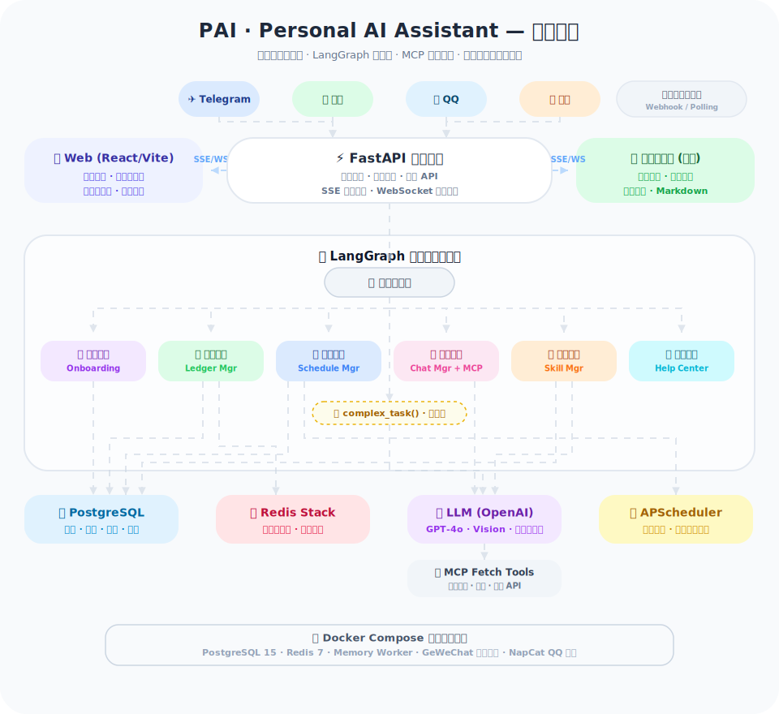
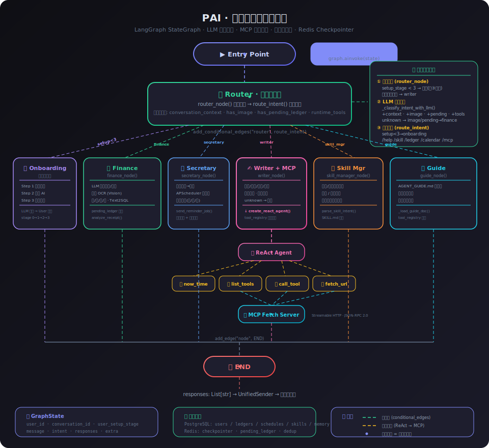
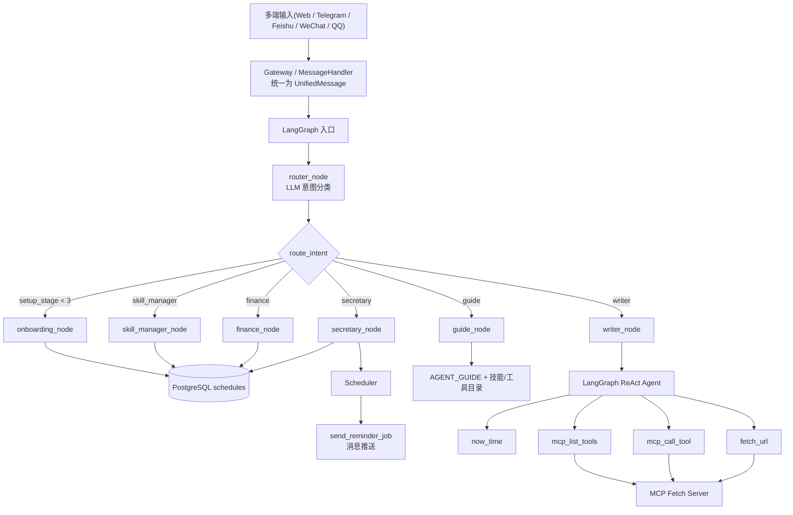

<div align="center">

# 🤖 PAI — Personal AI Assistant

**中心化多用户智能助理，多平台统一接入，一个 AI 为你打理一切。**

[](https://fastapi.tiangolo.com)
[](https://react.dev)
[](https://github.com/langchain-ai/langgraph)
[](https://www.docker.com)
[](https://www.typescriptlang.org)
[](https://tailwindcss.com)

</div>

---

## 📐 系统架构

<p align="center">
  
</p>

---

## ✨ 功能亮点

### 🌐 多平台统一接入
| 平台 | 接入方式 | 说明 |
|------|---------|------|
| **Telegram** | Webhook / Polling | 支持 Bot Token 接入，无 HTTPS 可用轮询模式 |
| **微信** | GeWeChat 网关 | 通过 GeWeChat 容器实现微信消息收发 |
| **QQ** | NapCat (OneBot v11) | HTTP POST 回调 + 主动发送 |
| **飞书** | 事件订阅 | App ID/Secret 配置后即用 |
| **微信小程序** | 独立客户端 | `wx.login` + JWT，支持在线 WS 与离线订阅提醒 |
| **Web** | 独立客户端 | React SPA，支持 SSE 流式对话 |

### 🧠 LangGraph 智能工作流
基于 LangGraph 的有向图工作流，通过 LLM 自动识别用户意图并路由到专业节点：

<p align="center">
  
</p>

- **🔀 Router** — 意图分类器，自动识别消息类型，支持 runtime_tools 上下文
- **💰 Finance** — 记账、消费统计、小票 OCR 识别
- **📅 Secretary** — 日程管理、定时提醒（APScheduler 持久化 · 多端广播投递）
- **✨️ Writer** — 翻译、润色、写作、通用问答、MCP 工具调用、天气查询
- **🎯 Skill Manager** — 用户自定义技能的创建/更新/发布
- **📖 Guide** — 使用指南、命令帮助、工具能力概览（加载 knowledge/AGENT_GUIDE.md）
- **🚀 Onboarding** — 新用户三步引导流程

<details>
<summary>📊 完整数据流（点击展开）</summary>



</details>

### 🎨 现代化 Web 客户端
- **深色 / 浅色主题** — 一键切换，跟随系统偏好
- **响应式布局** — 桌面端侧边栏 + 移动端抽屉式导航
- **流式输出** — SSE 实时显示 AI 回复，打字机效果
- **技能工作台** — 可视化创建、编辑、发布自定义 AI 技能
- **日历视图** — 按月查看账单与日程汇总
- **跨平台绑定** — 将多个平台身份绑定到同一账号
- **提醒多端广播** — 同一提醒可投递到全部已绑定身份并记录投递结果

### 🔧 核心特性
- **Redis 持久化 Checkpointer** — 对话状态持久存储，断线重连无丢失
- **消息去重** — 防止 Webhook 重复投递
- **JWT 认证** — Web 端安全登录/注册
- **WebSocket 实时推送** — 跨平台消息同步 & 定时提醒通知
- **系统级 MCP（Fetch）** — 统一网页抓取工具，可在对话中自然语言触发或命令触发
- **分层记忆系统** — 会话短期上下文 + 用户级长期记忆（检索注入，非全量喂模型）
- **管理 API** — 后台查看用户、账单、日程、审计日志
- **Docker Compose 一键部署** — 含 PostgreSQL、Redis、前后端及平台网关

---

## 🚀 快速开始

### 1. 环境准备

```bash
git clone <your-repo-url> pai
cd pai
cp .env.example .env
```

编辑 `.env`，填写必要配置（至少需要 `OPENAI_API_KEY`）。

### 2. 一键启动

```bash
docker compose up --build
```

### 3. 开始使用

| 服务 | 地址 |
|------|------|
| Web 客户端 | `http://localhost:3001` |
| 后端 API | `http://localhost:8000` |
| API 文档 | `http://localhost:8000/docs` |
| 微信小程序客户端 | `miniapp/`（微信开发者工具导入） |

首次访问 Web 端会引导注册账号，之后即可开始对话。

---

## 📂 项目结构

```text
pai/
├── backend/                    # FastAPI 后端
│   ├── app/
│   │   ├── api/                # 路由层
│   │   │   ├── endpoints/      # Webhook & 客户端 API
│   │   │   ├── admin.py        # 管理接口
│   │   │   └── deps.py         # 依赖注入
│   │   ├── core/               # 配置 & 安全
│   │   ├── db/                 # 数据库初始化 & 会话
│   │   ├── graph/              # LangGraph 工作流
│   │   │   ├── workflow.py     # 图构建 & Checkpointer
│   │   │   ├── state.py        # 状态定义
│   │   │   ├── context.py      # 会话上下文渲染
│   │   │   └── nodes/          # 各意图处理节点
│   │   ├── models/             # SQLModel 数据模型
│   │   ├── schemas/            # Pydantic 请求/响应模型 (+ mcp.py)
│   │   ├── services/           # 业务逻辑层
│   │   │   ├── platforms/      # 各平台发送适配器
│   │   │   ├── realtime.py     # WebSocket 实时通知推送
│   │   │   ├── memory.py       # 分层记忆系统 (提取/存储/检索)
│   │   │   ├── mcp_fetch.py    # MCP Fetch 网页抓取客户端
│   │   │   ├── tool_registry.py # 工具注册中心 (builtin + MCP)
│   │   │   ├── ledger_pending.py # Redis 待确认账单管理
│   │   │   ├── scheduler.py    # APScheduler 定时任务
│   │   │   └── llm.py          # LLM 客户端封装
│   │   └── tools/              # LangChain 工具 (记账/OCR)
│   ├── knowledge/              # 知识库文档 (AGENT_GUIDE.md)
│   └── skills/                 # 内置技能定义 (Markdown)
├── frontend/                   # React 前端
│   └── src/
│       ├── components/         # UI 组件
│       │   ├── chat/           # 对话、会话、账单、日历、绑定
│       │   ├── skills/         # 技能管理面板
│       │   └── ui/             # 基础 UI 组件 (Button/Card/Input)
│       ├── pages/              # 页面 (Chat / Login)
│       ├── store/              # Zustand 状态管理 (auth/theme)
│       └── lib/                # API 客户端 & 工具函数
├── miniapp/                    # 微信小程序客户端
│   ├── pages/
│   │   ├── login/              # 小程序登录
│   │   ├── home/               # 首页入口
│   │   ├── chat/               # 聊天 (流式 WS + 多图 + Markdown)
│   │   ├── ledger/             # 账单列表与统计
│   │   ├── calendar/           # 日历 (日程+账单聚合)
│   │   ├── me/                 # 个人中心与账号设置
│   │   ├── skills/             # 技能管理
│   │   └── bindmgr/            # 跨平台绑定管理
│   ├── utils/                  # 工具库
│   │   ├── auth.js             # 登录 & Token 管理
│   │   ├── http.js             # 请求封装
│   │   ├── image.js            # 图片工具
│   │   └── markdown.js         # Markdown 渲染
│   ├── assets/icons/           # TabBar 图标 (PNG 81×81)
│   └── config.js               # 后端域名与模板ID配置
├── docker-compose.yml          # 服务编排 (backend/frontend/db/redis/gewechat/napcat)
└── docs/
    ├── architecture.svg        # 系统架构图
    ├── agent-workflow.svg      # 智能体决策流程图
    ├── miniapp-client-full.md  # 小程序完整接入文档
    └── wechat-miniapp-setup.md # 微信小程序联调指南
```

---

## 🔌 API 参考

### 认证
| 方法 | 路径 | 说明 |
|------|------|------|
| POST | `/api/auth/register` | 注册新用户 |
| POST | `/api/auth/login` | 登录获取 JWT |
| POST | `/api/miniapp/auth/login` | 小程序登录（code 换取 JWT） |

### 对话
| 方法 | 路径 | 说明 |
|------|------|------|
| POST | `/api/chat/send?stream=true` | 发送消息（支持 SSE 流式） |
| GET | `/api/chat/history` | 获取对话历史 |

### MCP
| 方法 | 路径 | 说明 |
|------|------|------|
| GET | `/api/mcp/tools` | 获取系统级 MCP 工具列表 |
| POST | `/api/mcp/fetch` | 调用 MCP `fetch` 抓取网页内容 |

### 会话管理
| 方法 | 路径 | 说明 |
|------|------|------|
| GET | `/api/conversations` | 获取会话列表 |
| GET | `/api/conversations/current` | 获取当前活跃会话 |
| POST | `/api/conversations` | 创建新会话 |
| POST | `/api/conversations/:id/switch` | 切换活跃会话 |
| PATCH | `/api/conversations/:id` | 重命名会话 |
| DELETE | `/api/conversations/:id` | 删除会话 |

### 账单
| 方法 | 路径 | 说明 |
|------|------|------|
| GET | `/api/ledgers?limit=20` | 获取账单列表 |
| PATCH | `/api/ledgers/:id` | 修改账单 |
| DELETE | `/api/ledgers/:id` | 删除账单 |
| GET | `/api/stats/ledger` | 账单统计概览 |

### 日历
| 方法 | 路径 | 说明 |
|------|------|------|
| GET | `/api/calendar?start_date=&end_date=` | 获取日期范围内的账单与日程 |

### 技能
| 方法 | 路径 | 说明 |
|------|------|------|
| GET | `/api/skills` | 获取技能列表 |
| GET | `/api/skills/:slug?source=` | 获取技能详情 |
| POST | `/api/skills/draft` | 创建技能草稿 |
| POST | `/api/skills/:slug/publish` | 发布技能 |
| POST | `/api/skills/:slug/disable` | 停用技能 |

### 跨平台绑定
| 方法 | 路径 | 说明 |
|------|------|------|
| GET | `/api/user/profile` | 获取用户资料 |
| GET | `/api/user/identities` | 获取已绑定身份 |
| POST | `/api/user/bind-code` | 生成绑定码 |
| POST | `/api/user/bind-consume` | 使用绑定码绑定 |

### WebSocket
| 协议 | 路径 | 说明 |
|------|------|------|
| WS | `/api/chat/ws?token=JWT` | WebSocket 实时双向对话 |
| WS | `/api/notifications/ws?token=JWT` | 实时通知推送（提醒、跨平台消息） |

完整小程序接入与提醒架构见：`docs/miniapp-client-full.md`
微信小程序客户端导入与联调步骤见：`docs/wechat-miniapp-setup.md`

### Webhook 入口
| 方法 | 路径 | 说明 |
|------|------|------|
| POST | `/webhook/telegram` | Telegram Bot 回调 |
| POST | `/webhook/wechat` | 微信 GeWeChat 回调 |
| POST | `/webhook/qq` | QQ NapCat 回调 |
| POST | `/webhook/feishu` | 飞书事件回调 |

### 管理 API
需要 `X-Admin-Token` 请求头（与 `.env` 中 `ADMIN_TOKEN` 一致）：

| 方法 | 路径 | 说明 |
|------|------|------|
| GET | `/api/users` | 用户列表 |
| GET | `/api/ledgers` | 全部账单 |
| GET | `/api/schedules` | 全部日程 |
| GET | `/api/audit` | 审计日志 |

---

## ⚙️ 平台接入配置

### Telegram
```env
TELEGRAM_BOT_TOKEN=your_bot_token
TELEGRAM_WEBHOOK_SECRET=your_secret
# 无 HTTPS 可用轮询模式：
TELEGRAM_POLLING_ENABLED=true
```

### 飞书
```env
FEISHU_APP_ID=your_app_id
FEISHU_APP_SECRET=your_app_secret
FEISHU_VERIFICATION_TOKEN=your_token
```

### QQ (NapCat)
Docker Compose 已预配置 NapCat 容器，HTTP POST 自动回调 `/webhook/qq`。

### 微信 (GeWeChat)
```env
GEWECHAT_BASE_URL=http://gewechat:2531
GEWECHAT_APP_ID=your_app_id
GEWECHAT_TOKEN=your_token
```

### System MCP (Fetch)
```env
MCP_FETCH_ENABLED=true
MCP_FETCH_URL=your_mcp_server_url
MCP_FETCH_TIMEOUT_SEC=30
MCP_FETCH_DEFAULT_MAX_LENGTH=5000
```
说明：`MCP_FETCH_URL` 必须在 `.env` 中显式配置，代码中不再内置真实地址。

对话中可直接使用：
- 自然语言：`帮我抓取并总结这个网页 https://example.com`
- 自然语言：`现在武汉天气`
- 命令兜底：`/mcp list`、`/fetch https://example.com`、`/weather 武汉`

---

## 🖥️ 前端开发

```bash
cd frontend
npm install
npm run dev
```

开发模式自动代理 `/api` 到 `http://localhost:8000`。

### 微信小程序配置（开发/生产区分）

1. 小程序前端使用 `miniapp/config.js` 按 `envVersion` 自动切换环境：
- `develop` -> `DEV_API_BASE_URL`
- `trial` -> `TRIAL_API_BASE_URL`
- `release` -> `PROD_API_BASE_URL`

2. 在本地创建私有覆盖文件（不提交到仓库）：
```bash
cp miniapp/config.local.example.js miniapp/config.local.js
```
然后填写你的真实域名与模板 ID。

3. `miniapp/project.config.json` 使用模板 `appid`（`touristappid`）用于仓库共享。
真实 `appid` 请只在本机微信开发者工具或私有配置中设置。

4. 安全建议：
- `AppID` 可公开，但不建议在公共仓库固定生产 `AppID`
- `AppSecret` 只能放后端 `.env`（`MINIAPP_APP_SECRET`），禁止出现在前端代码

| 技术栈 | 用途 |
|--------|------|
| React 18 | UI 框架 |
| TypeScript | 类型安全 |
| Vite | 构建工具 |
| Tailwind CSS | 样式系统 |
| Zustand | 状态管理 |
| React Query | 数据请求 |
| Recharts | 数据可视化 |
| Lucide React | 图标库 |

---

## 📝 环境变量

| 变量 | 必填 | 默认值 | 说明 |
|------|------|--------|------|
| `OPENAI_API_KEY` | ✅ | - | OpenAI API 密钥 |
| `OPENAI_BASE_URL` | - | `https://api.openai.com/v1` | OpenAI API 地址 |
| `OPENAI_MODEL` | - | `gpt-4o` | 默认模型 |
| `DB_PASSWORD` | ✅ | - | PostgreSQL 密码 |
| `JWT_SECRET` | ✅ | `change_me` | JWT 签名密钥 |
| `MINIAPP_APP_ID` | - | - | 小程序 AppID |
| `MINIAPP_APP_SECRET` | - | - | 小程序 AppSecret |
| `MINIAPP_SUBSCRIBE_TEMPLATE_ID` | - | - | 小程序订阅消息模板 ID |
| `MCP_FETCH_ENABLED` | - | `true` | 是否启用系统级 MCP Fetch |
| `MCP_FETCH_URL` | 条件必填 | - | MCP Fetch 服务地址（`MCP_FETCH_ENABLED=true` 时必填） |
| `MCP_FETCH_TIMEOUT_SEC` | - | `30` | MCP 请求超时秒数 |
| `MCP_FETCH_DEFAULT_MAX_LENGTH` | - | `5000` | 默认抓取字符上限 |
| `LONG_TERM_MEMORY_ENABLED` | - | `true` | 是否启用长期记忆 |
| `LONG_TERM_MEMORY_MIN_CONFIDENCE` | - | `0.75` | 写入长期记忆的最小置信度 |
| `LONG_TERM_MEMORY_MAX_WRITE_ITEMS` | - | `6` | 单轮最多写入记忆条数 |
| `LONG_TERM_MEMORY_RETRIEVE_LIMIT` | - | `6` | 单轮注入模型的记忆条数 |
| `LONG_TERM_MEMORY_RETRIEVE_SCAN_LIMIT` | - | `80` | 检索候选扫描上限 |
| `LONG_TERM_MEMORY_DEFAULT_TTL_DAYS` | - | `180` | 默认记忆过期天数 |
| `ADMIN_TOKEN` | - | - | 管理 API 令牌 |
| `REDIS_URL` | - | `redis://redis:6379/0` | Redis 连接 |
| `TIMEZONE` | - | `Asia/Shanghai` | 时区 |

> 完整变量列表见 `.env.example`。

---

## 📄 License

MIT
