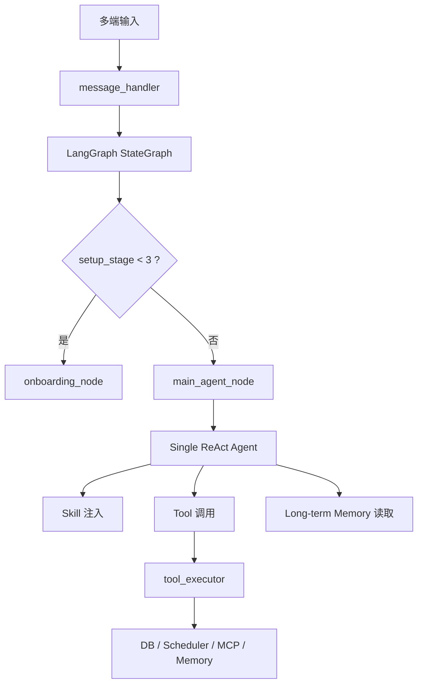
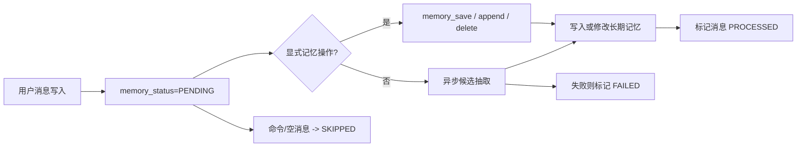

# 从 OpenClaw 到当前单主 Agent：工具构建与长期记忆的工程化重构

## 摘要

在上一篇文章《[从OpenClaw到实现如何实现个人Agent：基于LangChain 和 LangGraph 的 Agent 设计](https://blog.csdn.net/Lsogod/article/details/158806712?spm=1011.2124.3001.6209)》里，我更关注的是 Router、Planner、多节点协作与复杂任务编排。而到了当前这个分支，系统的重点已经发生了明显变化：我没有继续把主链路做成更复杂的多 Agent 编排，而是把架构收敛为单主 Agent，并把真正的工程复杂度压到两个核心能力上：

1. 工具如何构建，才能让 Agent 不只是“会调几个函数”
2. 长期记忆如何设计，才能让系统既能记住用户，又不会把状态写乱

这一版的架构理念，和 OpenClaw 已经越来越接近：单主 Agent 负责决策，Skill 负责策略约束，Tool 负责执行，Memory 负责用户状态。但在实现层面，它仍然是基于 `LangGraph + create_react_agent` 的自建版本，而不是 OpenClaw 原生运行时。

本文只聚焦两件事：工具构建与长期记忆。

## 一、从旧版本到当前分支：为什么架构开始收敛

上一篇文章对应的那一版，核心问题是“如何让 Agent 能路由、能拆任务、能在多个节点之间协作”。那时系统更像一个不断外扩的多节点编排器：

- Router 决定意图
- Planner 负责任务分解
- 各类 manager 节点分别处理聊天、账单、提醒、帮助中心等场景

这种设计适合系统早期，因为它能快速把复杂行为拆开。但继续发展下去，很容易碰到两个工程问题：

1. 节点越来越多，能力边界越来越模糊
2. 真正的复杂度没有减少，只是被转移到节点之间

当前分支的思路正好相反：主链路收敛为一个单主 Agent，外层图只负责少量稳定状态，比如 onboarding 分流和 pending flow 短路；真正的任务决策由主 Agent 完成，而所有可执行能力统一下沉到工具层，所有用户长期状态统一下沉到记忆层。

可以把这版理解成从“编排中心化”转向“能力中心化”。

## 二、当前架构和 OpenClaw 的关系：相似的是理念，不同的是落地

如果只看理念，当前分支确实越来越像 OpenClaw：

- 单主 Agent
- Skill 作为策略层
- Tool 作为执行层
- Memory 作为用户状态层

但如果看实现，它们仍然不是一套系统。

### 2.1 相似点

当前版本和 OpenClaw 相似的地方，主要在于“能力分层”：

- Agent 负责理解用户意图与决策
- Skill 不直接执行副作用，而是提供任务方法和输出约束
- Tool 提供真正的系统能力
- Memory 负责跨会话用户状态

这比早期那种“一切都写进 prompt”或者“一切都做成节点”要更接近长期可维护的 Agent 架构。

### 2.2 不同点

当前分支依然是典型的 `LangGraph` 工程体系：

- 外层使用 `StateGraph`
- 主 Agent 使用 `langgraph.prebuilt.create_react_agent`
- 工具通过 `LangChain tool` 包装暴露给模型
- 长期记忆是数据库表 + 异步提取 + 消息级状态
- Skill 当前是 `SKILL.md` 文档注入，而不是独立 plugin/runtime

所以更准确的说法应该是：

**当前分支在架构理念上越来越接近 OpenClaw，但在技术实现上仍然是自己的 LangGraph 版本。**

## 三、工具构建：不是给模型挂函数，而是四层结构

当前版本的工具系统，不是简单“写几个函数给 LLM 调”，而是拆成了四层。

### 3.1 工具注册表：先定义系统里有什么能力

第一层是工具注册表。这里不直接执行工具，只负责定义：

- 工具名
- 工具来源
- 工具描述
- 是否启用

例如当前分支里，长期记忆已经不再只是“查看记忆”，而是完整支持：

- `memory_list`
- `memory_save`
- `memory_append`
- `memory_delete`

这样做的价值是把系统能力目录从 prompt 中抽离出来，形成统一的能力元数据。

### 3.2 工具集合编排：决定节点能看到哪些工具

第二层是工具集合编排。系统先把工具按领域拆分，再组合成节点级能力范围：

- shared tools
- MCP tools
- conversation/memory tools
- ledger tools
- schedule tools
- profile tools

主 Agent 可以看到全量工具，专用节点则只看到与自身职责相关的工具。这一步解决的是“工具权限边界”问题，而不是让所有节点默认拥有所有能力。

### 3.3 LangChain Tool 包装：给模型的是稳定接口

第三层是 LangChain Tool 包装层。它的任务不是实现业务逻辑，而是向模型暴露稳定、可推理的工具签名。

例如当前记忆相关工具已经被显式包装成：

- `memory_save(content, memory_type, importance, confidence, ttl_days, key)`
- `memory_append(content, memory_id | memory_key | target_hint, ...)`
- `memory_delete(memory_id | memory_key | target_hint, ...)`

这意味着模型看到的是一套明确的工具 API，而不是后端内部散乱函数。

### 3.4 工具执行层：所有副作用统一收口

第四层也是最关键的一层：执行层。

所有真正会产生副作用的行为，最终都进入统一执行入口。执行层负责：

- 参数校验
- 数据库读写
- 时间语义归一化
- JSON 输出序列化
- 审计与 usage 记录
- 成功/失败结果统一格式

这一层的意义很大，因为它明确分离了两件事：

- Agent 决定“何时调用工具”
- 系统决定“工具调用后如何正确执行”

也就是说，prompt 负责决策，执行层负责正确性。

## 四、为什么我认为工具系统的重点是可控性，而不是数量

很多 Agent 项目后期失控，并不是因为模型不够强，而是因为工具边界太松散。当前版本里，我更看重的是下面三件事。

### 4.1 工具输出应该是结构化结果

当前执行层不只返回字符串，还会返回结构化的 `output_data`。这样做的好处是：

- Agent 可以继续消费结构化结果
- 前端和日志系统可以读取稳定字段
- 后续流程不必再从自然语言里反解析数据

### 4.2 时间语义必须在工具层收口

这版中我专门把时间问题往工具层收。原因很简单：用户说的是本地时间语义，数据库存的不一定是同一种时间语义。如果这件事交给 prompt，长期一定会出问题；只有放到执行层，系统才会稳定。

### 4.3 显式工具永远比隐式规则稳定

比如长期记忆，当前版本没有继续依赖“用户说了某类句子，模型自己猜是不是该记”。而是把能力显式化为：

- 新建或覆写：`memory_save`
- 追加内容：`memory_append`
- 删除记忆：`memory_delete`

这样系统能力是可枚举、可审计、可治理的。

## 五、长期记忆：不是聊天记录，而是可维护的数据对象

当前版本里的长期记忆，不再只是聊天记录摘要，也不是简单把历史消息直接塞进 prompt。它已经变成了明确的数据层对象，拥有自己的结构字段，例如：

- `memory_key`
- `memory_type`
- `content`
- `importance`
- `confidence`
- `source_message_id`
- `conversation_id`
- `updated_at`

这意味着长期记忆不再只是“上下文材料”，而是可以被：

- 查询
- 写入
- 覆写
- 追加
- 删除
- 去重
- 合并

从这个角度看，当前版本里的长期记忆已经不是一个聊天附属功能，而是一个独立的数据系统。

## 六、长期记忆设计里最关键的三个问题

### 6.1 什么信息值得进入长期记忆

用户的一句话里经常混着：

- 当前轮对话上下文
- 一次性信息
- 值得长期保留的偏好
- 值得长期保留的规则和约束

所以系统不会把每条消息直接落成长期记忆，而是先抽取候选，再做 refine 和筛选。这一步的目的，是避免把短期噪声写进长期记忆表。

### 6.2 如何保证同一类记忆能稳定演化

这件事的核心在于 `memory_key`。

如果没有稳定 key，就会出现：

- 同一件事越写越多条
- 更新找不到原记录
- 删除无法精确命中
- 追加内容时不知道该操作哪一条

所以当前版本会优先使用明确 key；如果没有 key，则做规范化；仍不明确时，再由模型辅助推断稳定 key；最后才退到哈希 key。

### 6.3 如何支持“更新”，而不是只会“新增”

当前版本已经支持：

- 同 `memory_key`：直接覆写
- key 不同但语义高度相似：语义合并
- 明确指定目标：追加或删除

这意味着长期记忆已经具备真正的数据生命周期，而不是只能越存越多。

## 七、从异步抽取到显式操作：长期记忆现在有两条写入路径

### 7.1 异步抽取路径

后台 worker 会扫描未处理用户消息，执行：

1. 候选记忆抽取
2. refine 与规范化
3. 去重和合并
4. 落库
5. 更新消息状态

这条路径适合处理那些“用户没有明确要求记住，但系统应该识别出值得长期保留的信息”的场景。

### 7.2 显式工具路径

当用户明确表达：

- “记住这个偏好”
- “把这条规则记下来”
- “在这条记忆上补充一点”
- “把刚才那条记忆删掉”

当前版本不再只是依赖后台抽取，而是允许主 Agent 直接调用：

- `memory_save`
- `memory_append`
- `memory_delete`

这一变化非常关键，因为它让长期记忆从“后台抽取得到的副产品”，升级成“Agent 可以明确操作的业务实体”。

## 八、消息级记忆状态：这是长期记忆系统真正稳定下来的关键

早期很多记忆系统都有一个问题：按会话级推进游标，只处理最后一条消息或者按粗粒度会话状态推进。一旦某条消息提取失败、被覆盖、或被后续消息稀释，就很容易丢失。

当前分支里，我把长期记忆状态从“会话级”下沉到了“消息级”。

每条用户消息现在都有：

- `memory_status`
- `memory_processed_at`
- `memory_error`

状态包括：

- `PENDING`
- `PROCESSED`
- `FAILED`
- `SKIPPED`

这带来的直接收益是：

1. worker 扫描的是未处理消息，而不是“会话最后处理到哪”
2. 失败消息可以重试
3. 命令消息和空消息可以明确跳过
4. 异步抽取与显式记忆工具共享同一套状态系统

## 九、显式记忆工具为什么必须和消息状态打通

如果显式记忆操作成功后，消息状态没有同步推进，就会出现非常典型的冲突：

- 用户已经明确要求写记忆
- 工具也已经成功执行
- 后台 worker 仍然把这条消息当作 `PENDING`
- 同一条消息又被异步抽取重复处理一遍

因此当前版本里，我专门做了一件事：

**只要 `memory_save`、`memory_append`、`memory_delete` 成功，当前这条用户消息就会直接被标记为 `PROCESSED`。**

这样显式操作和异步抽取就不再打架，长期记忆系统才真正形成闭环。

## 十、当前版本里，Skill 的位置是什么

虽然本文重点是工具和长期记忆，但还需要补一句：当前分支里的 Skill 也已经变得重要。

它的定位不是工具，而是 Agent 的策略层。Skill 当前通过 `SKILL.md` 形式存在，系统会从内置 skill 和用户已发布 skill 中选出相关文档，将其注入主 Agent 的 system prompt。

所以当前分支的能力分层已经越来越清晰：

- Tool：执行能力
- Skill：策略能力
- Memory：用户状态能力

这也是为什么我会说，这版架构在理念上越来越接近 OpenClaw。

## 十一、总结

如果只用一句话总结当前分支的变化，我会这样说：

**它不是把 Agent 做得更花，而是把 Agent 做得更像一个真正可维护的后端系统。**

在这一版里，我把工程重心明显转向了两件事：

- 工具构建：让模型调用能力变成分层、稳定、可治理的执行系统
- 长期记忆：让用户信息变成可写、可改、可删、可追踪状态的数据对象

而这正是一个 Agent 项目从 demo 走向长期运行系统时，最需要补的那部分工程能力。

## 参考

- 上一版文章：<https://blog.csdn.net/Lsogod/article/details/158806712?spm=1011.2124.3001.6209>
- 当前分支代码入口：
  - `backend/app/graph/workflow.py`
  - `backend/app/graph/nodes/main_agent.py`
  - `backend/app/services/tool_registry.py`
  - `backend/app/services/toolsets.py`
  - `backend/app/services/langchain_tools.py`
  - `backend/app/services/tool_executor.py`
  - `backend/app/services/memory.py`
  - `backend/app/services/message_handler.py`
