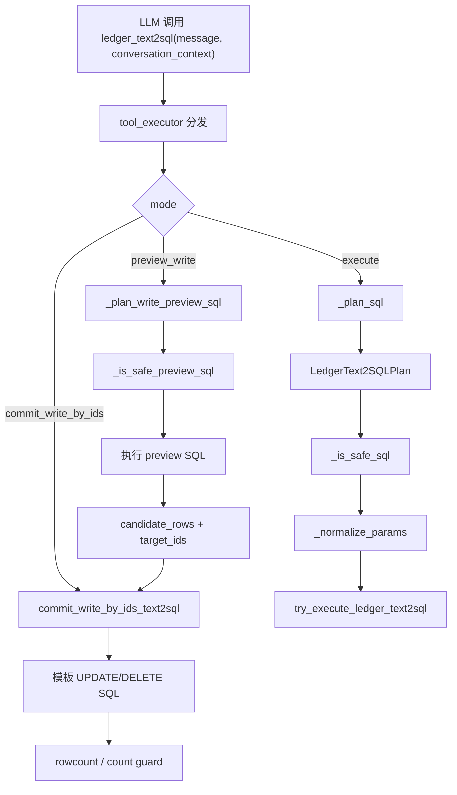
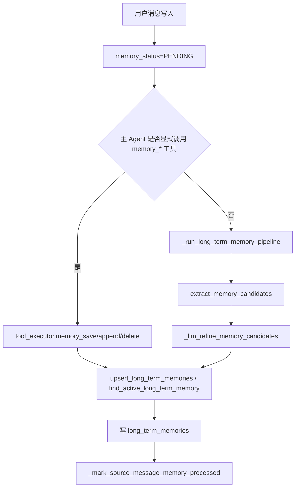

# 工具指南

## 1. 说明

本文档描述当前分支中**实际暴露给 LLM 的工具**，重点包括：

- 工具名称
- 工具描述
- 入参
- 出参
- 如何使用
- 暴露给 LLM 的方式
- 后端执行落点

这里以如下三层代码为准：

1. `backend/app/services/toolsets.py`
2. `backend/app/services/langchain_tools.py`
3. `backend/app/services/tool_executor.py`

也就是说，**是否暴露给 LLM** 以 `toolsets + langchain_tools` 为准，**是否真正执行成功** 以 `tool_executor` 或工具内联实现为准。

## 2. 暴露给 LLM 的方式

当前工具暴露采用统一链路：

`toolsets -> build_langchain_tools -> @tool(...) -> _run_tool(...) -> execute_capability_with_usage(...)`

### 2.1 工具选择范围

主 Agent 当前可见工具在 `backend/app/services/toolsets.py` 中定义，按领域分为：

- Shared
- MCP
- Conversation / Memory
- Ledger
- Schedule
- Profile

主 Agent 使用全量集合：

```python
MAIN_AGENT_TOOL_NAMES: set[str] = (
    SHARED_TOOL_NAMES
    | MCP_TOOL_NAMES
    | CONVERSATION_TOOL_NAMES
    | LEDGER_TOOL_NAMES
    | SCHEDULE_TOOL_NAMES
    | PROFILE_TOOL_NAMES
)
```

### 2.2 LangChain Tool 包装

每个工具都会被包装成 `@tool("tool_name")` 形式，例如：

```python
@tool("ledger_insert")
async def ledger_insert_tool(
    amount: float,
    category: str,
    item: str,
    transaction_date: str = "",
    image_url: str = "",
) -> str:
    return await _run_tool(
        context=context,
        source="builtin",
        name="ledger_insert",
        args={...},
    )
```

这意味着 LLM 实际看到的是：

- 工具名
- 函数签名
- docstring 描述

### 2.3 工具描述来源

当前工具描述主要有两层来源：

1. `langchain_tools.py` 里的 `@tool(...)` 函数 docstring  
   这是 LLM 最直接看到的描述
2. `tool_registry.py` 里的 `description` 字段  
   这是系统能力目录和运行时工具清单里的描述

本文档中的“工具描述”优先按当前 `@tool` docstring 来写，并在必要时补充注册表语义。

## 3. 通用返回格式

大部分工具最终通过 `tool_executor.py` 返回统一结构：

```python
{
  "ok": bool,
  "source": str,
  "name": str,
  "output": str,
  "output_data": Any | None,
  "error": str,
  "latency_ms": int
}
```

对 LLM 来说，通常消费的是 `output`。  
对系统内部来说，结构化结果保存在 `output_data`。

## 4. 工具总表

### 4.1 Shared

#### `now_time`
- 作用：按时区返回当前时间
- 工具描述：按时区名称返回当前本地时间，例如：`Asia/Shanghai`
- 暴露名：`now_time`
- 来源：`builtin`
- 入参：
  - `timezone: str = "Asia/Shanghai"`
- 出参：
  - `str`
  - 示例：`Asia/Shanghai 当前时间：2026-03-20 16:30:00`
- 使用场景：
  - 创建提醒前获取当前时间
  - 回答用户当前时间、时区相关问题
- 实现方式：
  - 在 `langchain_tools.py` 中包装为 `@tool("now_time")`
  - 通过 `_run_tool(...)` 转发到 `tool_executor.execute_capability_with_usage(...)`
  - 在 `tool_executor.py` 中命中 `if tool_l == "now_time"` 分支
  - 最终调用 `_render_now_time(timezone)` 直接生成文本结果，不访问数据库
- 实现路径：
  - 暴露：[backend/app/services/langchain_tools.py](../backend/app/services/langchain_tools.py)
  - 执行：[backend/app/services/tool_executor.py](../backend/app/services/tool_executor.py)
- 核心代码：

```python
@tool("now_time")
async def now_time_tool(timezone: str = "Asia/Shanghai") -> str:
    return await _run_tool(
        context=context,
        source="builtin",
        name="now_time",
        args={"timezone": timezone},
    )
```

```python
if tool_l == "now_time":
    timezone = str(params.get("timezone") or settings.timezone or "Asia/Shanghai").strip()
    return _result(True, output=_render_now_time(timezone))
```

#### `fetch_url`
- 作用：抓取网页或 JSON 内容
- 工具描述：抓取网页或 JSON 内容
- 暴露名：`fetch_url`
- 来源：`builtin`
- 入参：
  - `url: str`
  - `max_length: int = 5000`
  - `start_index: int = 0`
  - `raw: bool = False`
- 出参：
  - `str`
  - 通常是网页文本或 JSON 文本
- 使用场景：
  - 抓网页内容
  - 拉取公开 JSON 数据
- 实现方式：
  - 在 `langchain_tools.py` 中包装后统一转发到执行层
  - 在 `tool_executor.py` 的 `fetch_url` 分支中读取 `url/max_length/start_index/raw`
  - 最终调用 `get_mcp_fetch_client().fetch(...)`
  - 返回抓取到的原始文本或 JSON 字符串
- 注意：
  - 实际依赖 MCP fetch 能力
- 核心代码：

```python
@tool("fetch_url")
async def fetch_url_tool(
    url: str,
    max_length: int = 5000,
    start_index: int = 0,
    raw: bool = False,
) -> str:
    return await _run_tool(
        context=context,
        source="builtin",
        name="fetch_url",
        args={
            "url": url,
            "max_length": max_length,
            "start_index": start_index,
            "raw": raw,
        },
    )
```

```python
if tool_l == "fetch_url":
    output = await get_mcp_fetch_client().fetch(
        url=target,
        max_length=max_length,
        start_index=start_index,
        raw=raw,
    )
    return _result(True, output=output)
```

### 4.2 MCP

#### `mcp_list_tools`
- 作用：列出可用外部工具
- 工具描述：列出当前可用的外部工具
- 暴露名：`mcp_list_tools`
- 内部执行名：`tool_list`
- 来源：`builtin`
- 入参：无
- 出参：
  - `str`
  - 每行一个工具，格式类似：`- tool_name | enabled=true | description`
- 使用场景：
  - 在调用 MCP 工具前先查看有哪些工具
- 实现方式：
  - 对 LLM 暴露名是 `mcp_list_tools`
  - 内部通过 `_run_tool(...)` 调用 builtin 能力 `tool_list`
  - 执行层会读取运行时工具元数据 `list_runtime_tool_metas()`
  - 只筛出 `source == "mcp"` 的工具，再拼接成纯文本目录
- 核心代码：

```python
@tool("mcp_list_tools")
async def mcp_list_tools_tool() -> str:
    return await _run_tool(
        context=context,
        source="builtin",
        name="tool_list",
        args={},
    )
```

```python
if tool_l == "tool_list":
    runtime_tools = await list_runtime_tool_metas()
    mcp_tools = [dict(item) for item in runtime_tools if str(item.get("source") or "") == "mcp"]
    return _result(True, output=_render_mcp_tool_rows(mcp_tools))
```

#### `mcp_call_tool`
- 作用：按名称调用外部 MCP 工具
- 工具描述：按名称调用外部工具，并传入 JSON 参数
- 暴露名：`mcp_call_tool`
- 内部执行名：`tool_call`
- 来源：`builtin`
- 入参：
  - `tool_name: str`
  - `arguments_json: str = "{}"`
- 出参：
  - `str`
  - 外部工具原始返回结果
- 使用场景：
  - 已知 MCP 工具名时直接调用
- 实现方式：
  - 对 LLM 暴露名是 `mcp_call_tool`
  - `arguments_json` 会先在 `langchain_tools.py` 里解析成 dict
  - 执行层命中 `tool_call` 分支后做两层校验：
    - allowlist 校验
    - admin 开关校验
  - 校验通过后调用 `get_mcp_client_for_tool(...).call_tool(...)`
- 注意：
  - 受 allowlist 和 admin 开关控制
- 核心代码：

```python
@tool("mcp_call_tool")
async def mcp_call_tool_tool(tool_name: str, arguments_json: str = "{}") -> str:
    name = (tool_name or "").strip()
    args: dict[str, Any] = {}
    try:
        parsed = json.loads(arguments_json or "{}")
        if isinstance(parsed, dict):
            args = parsed
    except Exception:
        args = {}
    return await _run_tool(
        context=context,
        source="builtin",
        name="tool_call",
        args={"tool_name": name, "arguments": args},
    )
```

```python
if tool_l == "tool_call":
    if not is_mcp_tool_allowed(target_name):
        return _result(False, error="MCP tool blocked by allowlist")
    if not await is_tool_enabled("mcp", target_name):
        return _result(False, error="MCP tool disabled by admin")
    output = await get_mcp_client_for_tool(target_name).call_tool(
        name=target_name,
        arguments=target_args,
    )
    return _result(True, output=output)
```

#### `maps_weather`
- 作用：查询天气
- 工具描述：按城市名或 `adcode` 查询天气
- 暴露名：`maps_weather`
- 来源：`mcp`
- 入参：
  - `city: str = ""`
  - `adcode: str = ""`
- 出参：
  - `str`
  - 由 MCP 地图服务返回
- 使用场景：
  - 天气查询
- 实现方式：
  - 在 `langchain_tools.py` 中包装为 MCP 类型工具
  - 参数 `city/adcode` 二选一组装 payload
  - 执行时不走 builtin 分支，而是走 `source="mcp"`
  - 最终由 `get_mcp_client_for_tool("maps_weather").call_tool(...)` 完成调用
- 核心代码：

```python
@tool("maps_weather")
async def maps_weather_tool(city: str = "", adcode: str = "") -> str:
    payload: dict[str, Any] = {}
    if city.strip():
        payload["city"] = city.strip()
    elif adcode.strip():
        payload["adcode"] = adcode.strip()
    else:
        payload["city"] = ""
    return await _run_tool(
        context=context,
        source="mcp",
        name="maps_weather",
        args=payload,
    )
```

## 5. Ledger 工具

#### `analyze_receipt`
- 作用：分析小票或支付图片
- 工具描述：分析小票或支付图片，并返回结构化提取 JSON
- 入参：
  - `image_ref: str`
- 出参：
  - JSON 文本
  - `output_data` 为结构化 dict
- 使用场景：
  - 先识别票据，再结合 `ledger_insert` 记账
- 实现方式：
  - 在执行层命中 `analyze_receipt` 分支
  - 读取 `image_url` 或 `image_ref`
  - 调用 `app.tools.vision.analyze_receipt(...)`
  - 若结果是 dict，则直接作为 `output_data` 返回；否则包成 `{"result": ...}`
- 核心代码：

```python
@tool("analyze_receipt")
async def analyze_receipt_tool(image_ref: str) -> str:
    return await _run_tool(
        context=context,
        source="builtin",
        name="analyze_receipt",
        args={"image_ref": image_ref},
    )
```

```python
if tool_l == "analyze_receipt":
    image_url = str(params.get("image_url") or params.get("image_ref") or "").strip()
    output = await analyze_receipt(image_url)
    payload = output if isinstance(output, dict) else {"result": str(output)}
    return _result(True, output=json.dumps(payload, ensure_ascii=False), output_data=payload)
```

#### `ledger_text2sql`
- 作用：自然语言账单增删改查
- 工具描述：通过安全的 text2sql 流程执行自然语言账单增删改查
- 入参：
  - `message: str`
  - `conversation_context: str = ""`
- 出参：
  - `str` 或结构化 JSON
- 模式：
  - `execute`
  - `preview_write`
  - `commit_write_by_ids`
- 使用场景：
  - 复杂账单查询
  - 批量更新、删除账单
- 实现方式：
  - 执行层根据 `mode` 分三种路径：
    - `execute` -> `try_execute_ledger_text2sql(...)`
    - `preview_write` -> `plan_write_preview_text2sql(...)`
    - `commit_write_by_ids` -> `commit_write_by_ids_text2sql(...)`
  - 这条工具本质上是“自然语言到账单 SQL/写操作计划”的受保护入口，不直接在 LangChain tool 中写 SQL
- 核心代码：

```python
@tool("ledger_text2sql")
async def ledger_text2sql_tool(message: str, conversation_context: str = "") -> str:
    return await _run_tool(
        context=context,
        source="builtin",
        name="ledger_text2sql",
        args={
            "message": message,
            "conversation_context": conversation_context,
        },
    )
```

```python
if tool_l == "ledger_text2sql":
    if mode == "preview_write":
        output_data = await plan_write_preview_text2sql(...)
        return _result(True, output=json.dumps(output_data or {}, ensure_ascii=False), output_data=output_data or {})
    if mode == "commit_write_by_ids":
        output_data = await commit_write_by_ids_text2sql(...)
        return _result(True, output=json.dumps(output_data or {}, ensure_ascii=False), output_data=output_data or {})
    output = await try_execute_ledger_text2sql(...)
    return _result(True, output=str(output or ""))
```

#### `ledger_insert`
- 作用：新增账单
- 工具描述：插入一条账单记录，并返回 JSON 行数据
- 入参：
  - `amount: float`
  - `category: str`
  - `item: str`
  - `transaction_date: str = ""`
  - `image_url: str = ""`
- 出参：
  - JSON 文本
  - `output_data` 为账单对象：
    - `id`
    - `user_id`
    - `amount`
    - `currency`
    - `category`
    - `item`
    - `image_url`
    - `transaction_date`
- 使用场景：
  - 简单记账
- 实现方式：
  - 在执行层校验 `user_id/amount`
  - 对 `transaction_date` 做 `_parse_utc_naive_arg(...)` 归一化
  - 调用 `app.tools.finance.insert_ledger(...)`
  - 结果通过 `_ledger_to_payload(...)` 统一序列化后返回
- 核心代码：

```python
@tool("ledger_insert")
async def ledger_insert_tool(
    amount: float,
    category: str,
    item: str,
    transaction_date: str = "",
    image_url: str = "",
) -> str:
    return await _run_tool(
        context=context,
        source="builtin",
        name="ledger_insert",
        args={
            "amount": amount,
            "category": category,
            "item": item,
            "transaction_date": transaction_date,
            "image_url": image_url,
        },
    )
```

```python
if tool_l == "ledger_insert":
    transaction_date = _parse_utc_naive_arg(params.get("transaction_date")) or datetime.utcnow()
    row = await insert_ledger(
        session=session,
        user_id=uid,
        amount=amount,
        category=category,
        item=item,
        transaction_date=transaction_date,
        image_url=image_url,
        platform=platform,
    )
    payload = _ledger_to_payload(row)
    return _result(True, output=json.dumps(payload, ensure_ascii=False), output_data=payload)
```

#### `ledger_update`
- 作用：更新账单
- 工具描述：更新一条账单记录，并返回 JSON 行数据
- 入参：
  - `ledger_id: int`
  - `amount: float | None = None`
  - `category: str = ""`
  - `item: str = ""`
  - `transaction_date: str = ""`
- 出参：
  - 更新后的账单 JSON
- 实现方式：
  - 执行层按 `ledger_id` 定位账单
  - 对可选字段做逐项解析和校验
  - 调用 `app.tools.finance.update_ledger(...)`
  - 更新后统一转成 payload 返回
- 核心代码：

```python
@tool("ledger_update")
async def ledger_update_tool(
    ledger_id: int,
    amount: float | None = None,
    category: str = "",
    item: str = "",
    transaction_date: str = "",
) -> str:
    return await _run_tool(... )
```

```python
if tool_l == "ledger_update":
    row = await update_ledger(
        session=session,
        user_id=uid,
        ledger_id=ledger_id,
        amount=amount,
        category=category,
        item=item,
        transaction_date=transaction_date,
        platform=platform,
    )
```

#### `ledger_delete`
- 作用：删除账单
- 工具描述：删除一条账单记录，并返回被删除的 JSON 行数据
- 入参：
  - `ledger_id: int`
- 出参：
  - 被删除账单的 JSON
- 实现方式：
  - 执行层按 `ledger_id` 定位账单
  - 调用 `app.tools.finance.delete_ledger(...)`
  - 成功后返回被删除账单的序列化结果
- 核心代码：

```python
@tool("ledger_delete")
async def ledger_delete_tool(ledger_id: int) -> str:
    return await _run_tool(
        context=context,
        source="builtin",
        name="ledger_delete",
        args={"ledger_id": ledger_id},
    )
```

```python
if tool_l == "ledger_delete":
    row = await delete_ledger(
        session=session,
        user_id=uid,
        ledger_id=ledger_id,
        platform=platform,
    )
```

#### `ledger_get_latest`
- 作用：获取最新一条账单
- 工具描述：返回最新一条账单的 JSON；如果没有则返回空 JSON
- 入参：无
- 出参：
  - 有数据时返回账单 JSON
  - 无数据时返回 `{}`
- 实现方式：
  - 执行层调用 `app.tools.finance.get_latest_ledger(...)`
  - 若没有账单则返回空对象
  - 若有账单则统一经 `_ledger_to_payload(...)` 返回
- 核心代码：

```python
@tool("ledger_get_latest")
async def ledger_get_latest_tool() -> str:
    return await _run_tool(context=context, source="builtin", name="ledger_get_latest", args={})
```

```python
if tool_l == "ledger_get_latest":
    row = await get_latest_ledger(session=session, user_id=uid)
    if row is None:
        return _result(True, output=json.dumps({}, ensure_ascii=False), output_data={})
```

#### `ledger_list_recent`
- 作用：列出最近账单
- 工具描述：返回最近账单记录的 JSON 列表
- 入参：
  - `limit: int = 10`
- 出参：
  - JSON 数组
- 实现方式：
  - 执行层调用 `app.tools.finance.list_recent_ledgers(...)`
  - 再逐条调用 `_ledger_to_payload(...)` 进行序列化
- 核心代码：

```python
@tool("ledger_list_recent")
async def ledger_list_recent_tool(limit: int = 10) -> str:
    return await _run_tool(
        context=context,
        source="builtin",
        name="ledger_list_recent",
        args={"limit": limit},
    )
```

#### `ledger_list`
- 作用：按条件查询账单
- 工具描述：按可选的 id、日期、分类、摘要条件列出账单，并返回 JSON 列表
- 入参：
  - `limit: int = 100`
  - `start_at: str = ""`
  - `end_at: str = ""`
  - `category: str = ""`
  - `item_like: str = ""`
  - `order: str = "desc"`
  - `ledger_ids: list[int] | None = None`
- 出参：
  - JSON 数组
- 使用场景：
  - 按日期范围、分类、关键字筛选账单
- 实现方式：
  - 执行层直接拼 SQLAlchemy 查询条件
  - 支持：
    - `ledger_ids` 精确筛选
    - `start_at/end_at` 时间窗口
    - `category` 精确筛选
    - `item_like` 模糊查询
    - `order` 排序
  - 对日期型 `end_at` 会自动扩成整天结束边界
- 核心代码：

```python
@tool("ledger_list")
async def ledger_list_tool(
    limit: int = 100,
    start_at: str = "",
    end_at: str = "",
    category: str = "",
    item_like: str = "",
    order: str = "desc",
    ledger_ids: list[int] | None = None,
) -> str:
    return await _run_tool(... )
```

```python
if tool_l == "ledger_list":
    stmt = select(Ledger).where(Ledger.user_id == uid)
    if start_at is not None:
        stmt = stmt.where(Ledger.transaction_date >= start_at)
    if end_at is not None:
        stmt = stmt.where(Ledger.transaction_date < end_at)
    if category:
        stmt = stmt.where(Ledger.category == category)
    if item_like:
        stmt = stmt.where(Ledger.item.ilike(f"%{item_like}%"))
```

## 6. Conversation / Memory 工具

#### `conversation_current`
- 作用：获取当前激活会话
- 工具描述：返回当前激活会话的 JSON 对象
- 入参：无
- 出参：
  - JSON 对象
  - 字段：
    - `id`
    - `title`
    - `summary`
    - `last_message_at`
    - `active`
- 实现方式：
  - 执行层先取当前用户
  - 调用 `ensure_active_conversation(...)`
  - 再通过 `_conversation_to_payload(...)` 返回标准化结果
- 核心代码：

```python
@tool("conversation_current")
async def conversation_current_tool() -> str:
    return await _run_tool(context=context, source="builtin", name="conversation_current", args={})
```

#### `conversation_list`
- 作用：列出会话
- 工具描述：返回带有激活标记的会话 JSON 数组
- 入参：
  - `limit: int = 20`
- 出参：
  - JSON 数组
- 实现方式：
  - 执行层先确保存在 active conversation
  - 调用 `list_conversations(...)`
  - 逐条转为统一 payload，并补上 `active` 标记
- 核心代码：

```python
@tool("conversation_list")
async def conversation_list_tool(limit: int = 20) -> str:
    return await _run_tool(
        context=context,
        source="builtin",
        name="conversation_list",
        args={"limit": limit},
    )
```

#### `memory_list`
- 作用：列出长期记忆
- 工具描述：返回长期记忆的 JSON 数组
- 入参：
  - `limit: int = 120`
- 出参：
  - JSON 数组
  - 每条记忆字段：
    - `id`
    - `memory_key`
    - `memory_type`
    - `content`
    - `importance`
    - `confidence`
    - `updated_at`
- 实现方式：
  - 执行层直接调用 `memory.list_long_term_memories(...)`
  - 该函数会过滤过期记忆和 identity/profile 类记忆
  - 同时更新 `last_accessed_at`
- 核心代码：

```python
@tool("memory_list")
async def memory_list_tool(limit: int = 120) -> str:
    return await _run_tool(
        context=context,
        source="builtin",
        name="memory_list",
        args={"limit": limit},
    )
```

```python
async def list_long_term_memories(session: AsyncSession, *, user_id: int, limit: int | None = 120) -> list[dict[str, Any]]:
    stmt = (
        select(LongTermMemory)
        .where(
            LongTermMemory.user_id == user_id,
            or_(LongTermMemory.expires_at.is_(None), LongTermMemory.expires_at > now),
        )
        .order_by(LongTermMemory.updated_at.desc(), LongTermMemory.id.desc())
    )
```

#### `memory_save`
- 作用：新增或覆写长期记忆
- 工具描述：将用户明确要求记住的信息写入长期记忆，并返回 JSON 结果
- 入参：
  - `content: str`
  - `memory_type: str = "fact"`
  - `importance: int = 3`
  - `confidence: float = 1.0`
  - `ttl_days: int = 180`
  - `key: str = ""`
- 出参：
  - JSON 对象
  - 字段：
    - `status: "saved"`
    - `content`
    - `memory_type`
    - `importance`
    - `confidence`
    - `ttl_days`
    - `source_message_id`
    - `conversation_id`
- 使用场景：
  - 用户明确要求“记住这件事”
- 注意：
  - 走 `upsert_long_term_memories(..., bypass_refine=True)`
  - 成功后会把当前消息标记为 `PROCESSED`
- 实现方式：
  - 执行层构造单条候选记忆：
    - `op=save`
    - `memory_type/key/content/importance/confidence/ttl_days`
  - 调用 `upsert_long_term_memories(...)`
  - 因为是显式记忆操作，所以 `bypass_refine=True`
  - 成功后调用 `_mark_source_message_memory_processed(...)` 推进消息级状态
- 核心代码：

```python
@tool("memory_save")
async def memory_save_tool(
    content: str,
    memory_type: str = "fact",
    importance: int = 3,
    confidence: float = 1.0,
    ttl_days: int = 180,
    key: str = "",
) -> str:
    return await _run_tool(... )
```

```python
if tool_l == "memory_save":
    processed = await upsert_long_term_memories(
        session=session,
        user_id=uid,
        conversation_id=conversation_id,
        source_message_id=(source_message_id or None),
        candidates=[{
            "op": "save",
            "memory_type": memory_type,
            "key": memory_key,
            "content": content,
            "importance": importance,
            "confidence": confidence,
            "ttl_days": ttl_days,
        }],
        user_text=f"用户明确要求记住：{content}",
        bypass_refine=True,
    )
```

#### `memory_append`
- 作用：向已有长期记忆追加内容
- 工具描述：向一条已有长期记忆追加内容，并返回 JSON 结果
- 入参：
  - `content: str`
  - `memory_id: int | None = None`
  - `memory_key: str = ""`
  - `target_hint: str = ""`
  - `memory_type: str = ""`
  - `separator: str = "；"`
  - `importance: int | None = None`
  - `confidence: float | None = None`
  - `ttl_days: int | None = None`
- 出参：
  - JSON 对象
  - `status` 可能为：
    - `"appended"`
    - `"unchanged"`
  - `memory` 为更新后的记忆对象
- 使用场景：
  - “在刚才那条记忆里再补充一点”
- 目标定位优先级：
  1. `memory_id`
  2. `memory_key`
  3. `target_hint`
- 实现方式：
  - 执行层先用 `find_active_long_term_memory(...)` 找目标记忆
  - 若已包含待追加内容，则直接返回 `status="unchanged"`
  - 否则按 `separator` 把新内容拼接到原 `content`
  - 可选同步更新 `importance/confidence/ttl_days`
  - 提交后同样会推进当前消息状态为 `PROCESSED`
- 核心代码：

```python
@tool("memory_append")
async def memory_append_tool(
    content: str,
    memory_id: int | None = None,
    memory_key: str = "",
    target_hint: str = "",
    memory_type: str = "",
    separator: str = "；",
    importance: int | None = None,
    confidence: float | None = None,
    ttl_days: int | None = None,
) -> str:
    return await _run_tool(... )
```

```python
if tool_l == "memory_append":
    target = await find_active_long_term_memory(...)
    if append_text in current_content:
        await _mark_source_message_memory_processed(...)
        return _result(True, output=json.dumps(payload, ensure_ascii=False), output_data=payload)
    target.content = f"{current_content}{separator}{append_text}" if current_content else append_text
    session.add(target)
    await session.commit()
```

#### `memory_delete`
- 作用：删除一条长期记忆
- 工具描述：删除一条已有长期记忆，并返回 JSON 结果
- 入参：
  - `memory_id: int | None = None`
  - `memory_key: str = ""`
  - `target_hint: str = ""`
  - `memory_type: str = ""`
- 出参：
  - JSON 对象
  - 结构：
    - `status: "deleted"`
    - `memory: {...}`
- 使用场景：
  - “忘掉这条记忆”
- 实现方式：
  - 执行层先用 `find_active_long_term_memory(...)` 找目标
  - 找到后直接 `session.delete(target)`
  - 删除完成后返回删除前的记忆快照
  - 同时推进当前消息状态为 `PROCESSED`
- 核心代码：

```python
@tool("memory_delete")
async def memory_delete_tool(
    memory_id: int | None = None,
    memory_key: str = "",
    target_hint: str = "",
    memory_type: str = "",
) -> str:
    return await _run_tool(... )
```

```python
if tool_l == "memory_delete":
    target = await find_active_long_term_memory(...)
    payload = _long_term_memory_to_payload(target)
    await session.delete(target)
    await session.commit()
```

## 7. Schedule 工具

#### `schedule_get_latest`
- 作用：获取最新一条日程
- 工具描述：返回最新一条日程提醒的 JSON；如果没有则返回空 JSON
- 入参：无
- 出参：
  - 有数据时返回日程 JSON
  - 无数据时返回 `{}`
- 实现方式：
  - 执行层按 `Schedule.id.desc()` 查询当前用户最后一条记录
  - 若无记录返回空对象
  - 若有记录则经 `_schedule_to_payload(...)` 返回
- 核心代码：

```python
@tool("schedule_get_latest")
async def schedule_get_latest_tool() -> str:
    return await _run_tool(
        context=context,
        source="builtin",
        name="schedule_get_latest",
        args={},
    )
```

#### `schedule_list_recent`
- 作用：列出最近日程
- 工具描述：返回最近日程提醒记录的 JSON 列表
- 入参：
  - `limit: int = 10`
- 出参：
  - JSON 数组
- 实现方式：
  - 执行层按 `Schedule.id.desc()` 取最近 N 条
  - 每条使用 `_schedule_to_payload(...)` 标准化
- 核心代码：

```python
@tool("schedule_list_recent")
async def schedule_list_recent_tool(limit: int = 10) -> str:
    return await _run_tool(
        context=context,
        source="builtin",
        name="schedule_list_recent",
        args={"limit": limit},
    )
```

#### `schedule_insert`
- 作用：新增日程 / 提醒
- 工具描述：创建一条日程提醒，并返回 JSON 行数据。`trigger_time` 格式：`YYYY-MM-DD HH:MM:SS`
- 入参：
  - `content: str`
  - `trigger_time: str`
  - `status: str = "PENDING"`
  - `job_id: str = ""`
- 出参：
  - JSON 对象
  - 字段：
    - `id`
    - `user_id`
    - `job_id`
    - `content`
    - `status`
    - `trigger_time`
- 使用场景：
  - 新建提醒
- 注意：
  - `trigger_time` 使用本地 naive 时间语义
  - `PENDING` 状态会同步注册 scheduler job
- 实现方式：
  - 执行层解析 `trigger_time`
  - 创建 `Schedule` ORM 对象
  - `flush()` 后拿到 `id`
  - 若状态为 `PENDING`，同步 `scheduler.add_job(...)`
  - `commit()` 后返回 payload
- 核心代码：

```python
@tool("schedule_insert")
async def schedule_insert_tool(
    content: str,
    trigger_time: str,
    status: str = "PENDING",
    job_id: str = "",
) -> str:
    return await _run_tool(... )
```

```python
if tool_l == "schedule_insert":
    row = Schedule(
        user_id=uid,
        job_id=job_id,
        content=content,
        trigger_time=trigger_time,
        status=status,
    )
    session.add(row)
    await session.flush()
    if status == "PENDING":
        scheduler.add_job(job_id, trigger_time, send_reminder_job, int(row.id or 0))
```

#### `schedule_update`
- 作用：更新日程
- 工具描述：更新一条日程提醒，并返回 JSON 行数据
- 入参：
  - `schedule_id: int`
  - `content: str = ""`
  - `trigger_time: str = ""`
  - `status: str = ""`
- 出参：
  - 更新后的日程 JSON
- 实现方式：
  - 执行层按 `schedule_id` 定位日程
  - 更新 `content/trigger_time/status`
  - 先尝试移除旧 job，再根据新状态决定是否重新注册 job
  - 成功后返回更新后的 payload
- 核心代码：

```python
@tool("schedule_update")
async def schedule_update_tool(
    schedule_id: int,
    content: str = "",
    trigger_time: str = "",
    status: str = "",
) -> str:
    return await _run_tool(... )
```

```python
if tool_l == "schedule_update":
    row = await session.get(Schedule, schedule_id)
    if content_value:
        row.content = content_value
    if trigger_time is not None:
        row.trigger_time = trigger_time
    if status_value:
        row.status = status_value
```

#### `schedule_delete`
- 作用：删除日程
- 工具描述：删除一条日程提醒，并返回被删除的 JSON 行数据
- 入参：
  - `schedule_id: int`
- 出参：
  - 被删除日程 JSON
- 注意：
  - 会同时删除 reminder delivery 记录
  - 会移除 scheduler job
- 实现方式：
  - 执行层按 `schedule_id` 定位日程
  - 先移除 scheduler job
  - 再清理 `ReminderDelivery` 记录
  - 最后删除 `Schedule` 并返回删除前快照
- 核心代码：

```python
@tool("schedule_delete")
async def schedule_delete_tool(schedule_id: int) -> str:
    return await _run_tool(
        context=context,
        source="builtin",
        name="schedule_delete",
        args={"schedule_id": schedule_id},
    )
```

```python
if tool_l == "schedule_delete":
    await session.execute(delete(ReminderDelivery).where(ReminderDelivery.schedule_id == schedule_id))
    await session.delete(row)
    await session.commit()
```

#### `schedule_list`
- 作用：按条件查询日程
- 工具描述：按可选状态和时间窗口列出日程，并返回 JSON 列表
- 入参：
  - `status: str = "all"`
  - `start_at: str = ""`
  - `end_at: str = ""`
  - `limit: int = 100`
  - `content_like: str = ""`
  - `order: str = "asc"`
  - `schedule_ids: list[int] | None = None`
- 出参：
  - JSON 数组
- 使用场景：
  - 查询未来提醒
  - 筛选已完成 / 待执行日程
- 实现方式：
  - 执行层直接拼 SQLAlchemy 查询条件
  - 支持：
    - `schedule_ids`
    - `status`
    - `start_at/end_at`
    - `content_like`
    - `order`
  - 日期型 `end_at` 也会自动扩成整天结束边界
- 核心代码：

```python
@tool("schedule_list")
async def schedule_list_tool(
    status: str = "all",
    start_at: str = "",
    end_at: str = "",
    limit: int = 100,
    content_like: str = "",
    order: str = "asc",
    schedule_ids: list[int] | None = None,
) -> str:
    return await _run_tool(... )
```

```python
if tool_l == "schedule_list":
    stmt = select(Schedule).where(Schedule.user_id == uid)
    if start_at is not None:
        stmt = stmt.where(Schedule.trigger_time >= start_at)
    if end_at is not None:
        stmt = stmt.where(Schedule.trigger_time < end_at)
    if content_like:
        stmt = stmt.where(Schedule.content.ilike(f"%{content_like}%"))
```

## 8. Profile 工具

### 特别说明

这组工具**没有走 `tool_executor`**，而是在 `langchain_tools.py` 里直接实现。

#### `update_user_profile`
- 作用：更新用户档案
- 工具描述：更新用户档案。可设置用户昵称 `nickname`、AI 助手名称 `ai_name`、AI 助手表情 `ai_emoji`，仅传入需要修改的字段
- 入参：
  - `nickname: str = ""`
  - `ai_name: str = ""`
  - `ai_emoji: str = ""`
- 出参：
  - `str`
  - 示例：
    - `昵称已更新为小李。`
    - `助手名称已更新为PAI，助手表情已更新为🤖。`
- 使用场景：
  - 用户改昵称
  - 用户修改助手名称或表情
- 注意：
  - 更新后会调用 `deactivate_identity_memories_for_user(...)`
  - 档案字段是 identity 真相源，不依赖长期记忆表
- 实现方式：
  - 这条工具不走 `tool_executor`
  - 直接在 `langchain_tools.py` 里打开 `AsyncSessionLocal()`
  - 修改 `User.nickname / ai_name / ai_emoji`
  - 若有变化，调用 `deactivate_identity_memories_for_user(...)` 失活对应 identity 记忆
  - 最后返回中文确认文本
- 核心代码：

```python
@tool("update_user_profile")
async def update_user_profile_tool(
    nickname: str = "",
    ai_name: str = "",
    ai_emoji: str = "",
) -> str:
    async with AsyncSessionLocal() as session:
        user = await session.get(User, user_id)
        if nickname and nickname != str(user.nickname or "").strip():
            user.nickname = nickname
        if ai_name and ai_name != str(user.ai_name or "").strip():
            user.ai_name = ai_name
        if ai_emoji and ai_emoji != str(user.ai_emoji or "").strip():
            user.ai_emoji = ai_emoji
```

#### `query_user_profile`
- 作用：查询当前用户档案
- 工具描述：查询当前用户的完整档案信息，包括昵称、助手名称、表情、平台、邮箱等
- 入参：无
- 出参：
  - 多行文本
  - 包括：
    - 昵称
    - 助手名称
    - 助手表情
    - 平台
    - 邮箱
- 实现方式：
  - 同样不走 `tool_executor`
  - 直接在 `langchain_tools.py` 中读取 `User`
  - 拼接成多行文本返回给 LLM
- 核心代码：

```python
@tool("query_user_profile")
async def query_user_profile_tool() -> str:
    async with AsyncSessionLocal() as session:
        user = await session.get(User, user_id)
        nickname = str(user.nickname or "").strip() or "未设置"
        ai_name = str(user.ai_name or "").strip() or "AI 助手"
        ai_emoji = str(user.ai_emoji or "").strip() or "🤖"
        platform = str(user.platform or "").strip() or "unknown"
        email = str(user.email or "").strip() or "未绑定"
        return (
            f"昵称：{nickname}\n"
            f"助手名称：{ai_name}\n"
            f"助手表情：{ai_emoji}\n"
            f"平台：{platform}\n"
            f"邮箱：{email}"
        )
```

## 9. 长期记忆相关底层实现

长期记忆工具最终依赖 `backend/app/services/memory.py`。

### 9.1 写入 / 覆写

`upsert_long_term_memories(...)` 负责：

- refine 候选记忆
- 生成或规范化 `memory_key`
- 同 key 覆写
- 语义相似合并
- 新增记忆

### 9.2 定位已有记忆

`find_active_long_term_memory(...)` 负责：

- 按 `memory_id` 精确命中
- 按 `memory_key` 精确命中
- 按 `target_hint` 做语义匹配

### 9.3 消息状态联动

显式记忆工具执行成功后，会调用消息状态推进逻辑，把当前用户消息标记为：

- `PROCESSED`

这样异步记忆抽取不会重复处理同一条消息。

## 10. 使用建议

### 10.1 给 LLM 的推荐使用顺序

#### 记忆相关

1. 如果用户问“我有哪些记忆”，调用 `memory_list`
2. 如果用户明确说“记住这个”，调用 `memory_save`
3. 如果用户说“在那条记忆上补充”，先 `memory_list` 确认目标，再 `memory_append`
4. 如果用户说“删掉那条记忆”，先 `memory_list` 确认目标，再 `memory_delete`

#### 日程相关

1. 查询最新提醒：`schedule_get_latest`
2. 查近期提醒：`schedule_list_recent`
3. 条件筛选：`schedule_list`
4. 新建提醒：`schedule_insert`
5. 改提醒：`schedule_update`
6. 删提醒：`schedule_delete`

#### 账单相关

1. 简单新增：`ledger_insert`
2. 复杂自然语言查询：`ledger_text2sql`
3. 过滤查询：`ledger_list`
4. 改 / 删：`ledger_update` / `ledger_delete`

## 11. 对应代码文件

- `backend/app/services/toolsets.py`
- `backend/app/services/tool_registry.py`
- `backend/app/services/langchain_tools.py`
- `backend/app/services/tool_executor.py`
- `backend/app/services/memory.py`

## 12. 核心代码片段

这一节只放“真正的代码实现”，用于开发时快速定位。结构按工具分组组织：

- 先看 `langchain_tools.py` 里的 `@tool(...)` 包装，这决定了暴露给 LLM 的名字、参数和描述
- 再看 `tool_executor.py` 里的执行分支，这决定了工具真正做什么
- 长期记忆工具还要继续看 `memory.py`

### 12.1 通用包装入口

几乎所有工具都先走统一包装函数：

```python
async def _run_tool(
    *,
    context: ToolInvocationContext,
    source: str,
    name: str,
    args: dict[str, Any],
) -> str:
    result = await execute_capability_with_usage(
        source=source,
        name=name,
        args=args,
        user_id=context.user_id,
        platform=context.platform,
        conversation_id=context.conversation_id,
    )
    ok = bool(result.get("ok"))
    output = str(result.get("output") or "")
    error = str(result.get("error") or "")
    if ok:
        return output
    return error or f"tool `{name}` failed"
```

这意味着大多数工具的真实链路是：

`@tool(...) -> _run_tool(...) -> execute_capability_with_usage(...) -> execute_capability(...)`

### 12.2 Shared

#### `now_time`

暴露给 LLM：

```python
@tool("now_time")
async def now_time_tool(timezone: str = "Asia/Shanghai") -> str:
    """按时区名称返回当前本地时间，例如：Asia/Shanghai。"""
    return await _run_tool(
        context=context,
        source="builtin",
        name="now_time",
        args={"timezone": timezone},
    )
```

执行逻辑：

```python
if tool_l == "now_time":
    timezone = str(params.get("timezone") or settings.timezone or "Asia/Shanghai").strip()
    return _result(True, output=_render_now_time(timezone))
```

#### `fetch_url`

暴露给 LLM：

```python
@tool("fetch_url")
async def fetch_url_tool(
    url: str,
    max_length: int = 5000,
    start_index: int = 0,
    raw: bool = False,
) -> str:
    """抓取网页或 JSON 内容。"""
    return await _run_tool(
        context=context,
        source="builtin",
        name="fetch_url",
        args={
            "url": url,
            "max_length": max_length,
            "start_index": start_index,
            "raw": raw,
        },
    )
```

执行逻辑：

```python
if tool_l == "fetch_url":
    if not settings.mcp_fetch_enabled:
        return _result(False, error="MCP fetch is disabled.")
    target = str(params.get("url") or "").strip()
    if not target:
        return _result(False, error="missing required arg: url")
    max_length = max(500, min(20000, int(params.get("max_length") or settings.mcp_fetch_default_max_length)))
    start_index = max(0, int(params.get("start_index") or 0))
    raw = bool(params.get("raw"))
    output = await get_mcp_fetch_client().fetch(
        url=target,
        max_length=max_length,
        start_index=start_index,
        raw=raw,
    )
    return _result(True, output=output)
```

### 12.3 MCP

#### `mcp_list_tools`

暴露给 LLM：

```python
@tool("mcp_list_tools")
async def mcp_list_tools_tool() -> str:
    """列出当前可用的外部工具。"""
    return await _run_tool(
        context=context,
        source="builtin",
        name="tool_list",
        args={},
    )
```

执行逻辑：

```python
if tool_l == "tool_list":
    if not settings.mcp_fetch_enabled:
        return _result(False, error="MCP fetch is disabled.")
    runtime_tools = await list_runtime_tool_metas()
    mcp_tools = [dict(item) for item in runtime_tools if str(item.get("source") or "") == "mcp"]
    return _result(True, output=_render_mcp_tool_rows(mcp_tools))
```

#### `mcp_call_tool`

暴露给 LLM：

```python
@tool("mcp_call_tool")
async def mcp_call_tool_tool(tool_name: str, arguments_json: str = "{}") -> str:
    """按名称调用外部工具，并传入 JSON 参数。"""
    name = (tool_name or "").strip()
    args: dict[str, Any] = {}
    try:
        parsed = json.loads(arguments_json or "{}")
        if isinstance(parsed, dict):
            args = parsed
    except Exception:
        args = {}
    return await _run_tool(
        context=context,
        source="builtin",
        name="tool_call",
        args={"tool_name": name, "arguments": args},
    )
```

执行逻辑：

```python
if tool_l == "tool_call":
    if not settings.mcp_fetch_enabled:
        return _result(False, error="MCP fetch is disabled.")
    target_name = str(params.get("tool_name") or params.get("name") or "").strip()
    if not target_name:
        return _result(False, error="missing required arg: tool_name")
    if not is_mcp_tool_allowed(target_name):
        allowed = sorted(get_allowed_mcp_tool_names_for(target_name))
        allowed_text = ", ".join(allowed) if allowed else "none"
        return _result(False, error=f"MCP tool `{target_name}` is blocked by allowlist. Allowed tools: {allowed_text}.")
    if not await is_tool_enabled("mcp", target_name):
        return _result(False, error=f"MCP tool `{target_name}` is disabled by admin.")
    target_args = params.get("arguments")
    if not isinstance(target_args, dict):
        target_args = {}
    output = await get_mcp_client_for_tool(target_name).call_tool(name=target_name, arguments=target_args)
    return _result(True, output=output)
```

#### `maps_weather`

暴露给 LLM：

```python
@tool("maps_weather")
async def maps_weather_tool(city: str = "", adcode: str = "") -> str:
    """按城市名或 adcode 查询天气。"""
    payload: dict[str, Any] = {}
    if city.strip():
        payload["city"] = city.strip()
    elif adcode.strip():
        payload["adcode"] = adcode.strip()
    else:
        payload["city"] = ""
    return await _run_tool(
        context=context,
        source="mcp",
        name="maps_weather",
        args=payload,
    )
```

真正执行会落到 MCP 通用分支：

```python
target_name = tool.strip()
target_norm = target_name.lower()
if not is_mcp_tool_allowed(target_norm):
    return _result(False, error="blocked by allowlist")
output = await get_mcp_client_for_tool(target_name).call_tool(name=target_name, arguments=params)
return _result(True, output=output)
```

### 12.4 Ledger

#### `analyze_receipt`

暴露给 LLM：

```python
@tool("analyze_receipt")
async def analyze_receipt_tool(image_ref: str) -> str:
    """分析小票或支付图片，并返回结构化提取 JSON。"""
    return await _run_tool(
        context=context,
        source="builtin",
        name="analyze_receipt",
        args={"image_ref": image_ref},
    )
```

执行逻辑：

```python
if tool_l == "analyze_receipt":
    image_url = str(params.get("image_url") or params.get("image_ref") or "").strip()
    if not image_url:
        return _result(False, error="missing required arg: image_url")
    output = await analyze_receipt(image_url)
    payload = output if isinstance(output, dict) else {"result": str(output)}
    return _result(
        True,
        output=json.dumps(payload, ensure_ascii=False),
        output_data=payload,
    )
```

#### `ledger_text2sql`

暴露给 LLM：

```python
@tool("ledger_text2sql")
async def ledger_text2sql_tool(message: str, conversation_context: str = "") -> str:
    """通过安全的 text2sql 流程执行自然语言账单增删改查。"""
    return await _run_tool(
        context=context,
        source="builtin",
        name="ledger_text2sql",
        args={
            "message": message,
            "conversation_context": conversation_context,
        },
    )
```

执行逻辑：

```python
if tool_l == "ledger_text2sql":
    message = str(params.get("message") or "").strip()
    conversation_context = str(params.get("conversation_context") or "").strip()
    mode = str(params.get("mode") or "execute").strip().lower()
    if mode == "preview_write":
        output_data = await plan_write_preview_text2sql(...)
        return _result(
            True,
            output=json.dumps(output_data or {}, ensure_ascii=False),
            output_data=output_data or {},
        )
    if mode == "commit_write_by_ids":
        output_data = await commit_write_by_ids_text2sql(...)
        return _result(
            True,
            output=json.dumps(output_data or {}, ensure_ascii=False),
            output_data=output_data or {},
        )
    output = await try_execute_ledger_text2sql(
        user_id=uid,
        message=message,
        conversation_context=conversation_context,
    )
    return _result(True, output=str(output or ""))
```

内部执行链：

`ledger_text2sql` 的核心不在 `tool_executor.py`，而在 [backend/app/tools/ledger_text2sql.py](/Users/mac/Documents/New%20project/backend/app/tools/ledger_text2sql.py)。

它不是“直接把自然语言拼成 SQL”，而是分成 4 步：

1. 让 LLM 输出结构化计划 `LedgerText2SQLPlan`
2. 对 SQL 做安全审计
3. 归一化时间参数和其他参数
4. 再决定是直接执行，还是走“预览 -> 按 id 提交”

第一步，先让模型输出结构化计划，而不是裸文本 SQL：

```python
class LedgerText2SQLPlan(BaseModel):
    matched: bool = Field(default=False)
    intent: str = Field(default="unknown")
    sql: str = Field(default="")
    params: dict[str, Any] = Field(default_factory=dict)
    summary: str = Field(default="")
    confidence: float = Field(default=0.0)
```

实际规划函数：

```python
async def _plan_sql(message: str, conversation_context: str = "") -> dict[str, Any]:
    llm = get_llm(node_name="ledger_text2sql")
    runnable = llm.with_structured_output(LedgerText2SQLPlan)
    system_prompt = (
        "你是 PostgreSQL 的账单 Text-to-SQL 规划器。\n"
        "只能操作 ledgers 表。\n"
        "必须且只能返回一个 json 对象。\n"
        "只返回结构化字段：matched, intent, sql, params, summary, confidence。\n"
        "intent 只能是 select/insert/update/delete/unknown 之一。\n"
        "对于 select/update/delete：SQL 必须包含 WHERE user_id = :user_id。\n"
        "对于 insert：插入列中必须显式包含 user_id。\n"
        "ledgers.transaction_date 在数据库中按 UTC-naive 存储。\n"
        "相对时间表达（今天/昨天/本月/上月）必须先按用户本地时区计算，再换算为 UTC-naive 参数。\n"
        "时间范围优先使用左闭右开区间 [start, end)。\n"
    )
    result = await runnable.ainvoke(
        [
            {"role": "system", "content": system_prompt},
            {"role": "user", "content": f"会话上下文:\n{conversation_context or '（无）'}\n\n用户消息:\n{message}"},
        ]
    )
```

第二步，对模型产出的 SQL 做安全检查。这里会拦截：

- 多语句
- `drop/alter/truncate/create/...`
- 非 `ledgers` 表
- 缺少 `user_id = :user_id`
- `update/delete` 没有额外过滤条件

核心安全函数：

```python
def _is_safe_sql(sql: str, intent: str, user_message: str) -> tuple[bool, str]:
    stmt = _strip_single_statement(sql)
    lower = stmt.lower()
    if not stmt:
        return False, "empty_sql"
    if ";" in stmt:
        return False, "multi_statement_not_allowed"
    if _FORBIDDEN_SQL.search(stmt):
        return False, "forbidden_keyword"
    if _OTHER_TABLES.search(stmt):
        return False, "non_ledger_table_detected"
    if " ledgers" not in f" {lower} ":
        return False, "must_target_ledgers"

    if intent == "select":
        if not lower.startswith("select "):
            return False, "intent_mismatch"
        if " where " not in lower:
            return False, "missing_where"
        if not _USER_FILTER.search(stmt):
            return False, "missing_user_filter"
        return True, ""
```

第三步，把 LLM 生成的时间参数统一归一化。这里是之前时间问题修复后的关键点：

```python
def _normalize_params(params: dict[str, Any]) -> dict[str, Any]:
    normalized: dict[str, Any] = {}
    local_tz = ZoneInfo(get_settings().timezone)
    for key, value in (params or {}).items():
        if isinstance(value, str):
            candidate = value.strip()
            if (
                key.endswith("_at")
                or "date" in key.lower()
                or "time" in key.lower()
            ):
                try:
                    dt = datetime.fromisoformat(candidate)
                    if dt.tzinfo is not None:
                        dt = dt.astimezone(timezone.utc).replace(tzinfo=None)
                    else:
                        dt = dt.replace(tzinfo=local_tz).astimezone(timezone.utc).replace(tzinfo=None)
                    normalized[key] = dt
                    continue
                except Exception:
                    pass
        normalized[key] = value
    return normalized
```

第四步分成两条路径。

普通查询/直接写入走 `try_execute_ledger_text2sql(...)`：

```python
async def try_execute_ledger_text2sql(
    user_id: int,
    message: str,
    conversation_context: str = "",
) -> str | None:
    plan = await _plan_sql(message, conversation_context)
    intent = str(plan.get("intent") or "unknown").strip().lower()
    confidence = float(plan.get("confidence") or 0.0)
    if confidence < 0.60:
        return None

    sql = _strip_single_statement(str(plan.get("sql") or ""))
    ok, reason = _is_safe_sql(sql, intent, message)
    if not ok:
        return f"该账单操作被安全策略拦截：{reason}。请换一种更明确的说法。"

    params = _normalize_params(dict(plan.get("params") or {}))
    params["user_id"] = user_id
    params.setdefault("now_utc", datetime.utcnow())
```

查询结果会被再次格式化成用户可读文本，而不是直接把 SQL 结果原样吐给模型：

```python
if intent == "select":
    result = await db.execute(stmt, params)
    rows = result.mappings().all()
    if not rows:
        return "没有匹配到账单记录。"
    lines = ["账单结果："]
    for row in rows[:12]:
        row_id = _extract_row_id(dict(row))
        amount = float(row.get("amount") or 0)
        category = str(row.get("category") or "其他")
        item = str(row.get("item") or "")
        transaction_date = row.get("occurred_at") or row.get("transaction_date") or ""
        time_text = _to_client_tz_text(transaction_date, assume_utc=True)[:16] if transaction_date else "未知时间"
        lines.append(f"#{row_id} | {time_text} | {amount:.2f} CNY | {category} | {item}")
    return "\n".join(lines)
```

而高风险写操作会优先走“预览 -> 按 id 提交”两阶段：

```python
async def plan_write_preview_text2sql(
    *,
    user_id: int,
    message: str,
    operation: str,
    conversation_context: str = "",
    preview_limit: int = 50,
    preview_hints: dict[str, Any] | None = None,
    update_fields: dict[str, Any] | None = None,
) -> dict[str, Any] | None:
    plan = await _plan_write_preview_sql(
        operation=op,
        message=message,
        preview_hints=normalized_hints,
        conversation_context=conversation_context,
    )
    sql = _strip_single_statement(str(plan.get("sql") or ""))
    ok, reason = _is_safe_preview_sql(sql)
    params = _normalize_params(dict(plan.get("params") or {}))
    params["user_id"] = user_id
    params["preview_limit"] = max(1, min(50, int(preview_limit or 50)))
```

预览 SQL 还要求更严格：

- 必须是 `SELECT`
- 必须有 `ORDER BY`
- 必须有 `LIMIT :preview_limit`
- 必须投影 `id, amount, category, item`
- `update/delete` 预览只能筛选“候选源记录”

最后真正写库时，不再信任 LLM 生成的写 SQL，而是只按预览确认过的 `target_ids` 执行模板 SQL：

```python
def _build_delete_stmt() -> Any:
    return (
        text("DELETE FROM ledgers WHERE user_id = :user_id AND id IN :target_ids")
        .bindparams(bindparam("target_ids", expanding=True))
    )

def _build_update_stmt(set_clauses: list[str]) -> Any:
    sql = (
        f"UPDATE ledgers SET {', '.join(set_clauses)} "
        "WHERE user_id = :user_id AND id IN :target_ids"
    )
    return text(sql).bindparams(bindparam("target_ids", expanding=True))
```

提交函数：

```python
async def commit_write_by_ids_text2sql(
    *,
    user_id: int,
    operation: str,
    target_ids: list[int],
    expected_count: int,
    update_fields: dict[str, Any] | None = None,
) -> dict[str, Any]:
    select_stmt = _build_ids_select_stmt()
    delete_stmt = _build_delete_stmt()
    update_stmt = _build_update_stmt(set_clauses) if op == "update" else None

    async with AsyncSessionLocal() as db:
        exists_result = await db.execute(select_stmt, params)
        existing_ids = [int(row[0]) for row in exists_result.all()]
        existing_count = len(existing_ids)
        if existing_count != expected:
            await db.rollback()
            return {"ok": False, "error": "count_mismatch"}

        if op == "delete":
            result = await db.execute(delete_stmt, params)
        else:
            result = await db.execute(update_stmt, params)
        await db.commit()
```

所以这套 `text2sql` 的真实实现逻辑是：

`自然语言 -> LLM 生成结构化计划 -> 安全检查 -> 参数归一化 -> 预览或执行 -> 结果再格式化`

它不是“模型直接拼 SQL 然后裸执行”，而是被拆成了规划层、审计层、执行层三个部分。

#### `ledger_insert`

暴露给 LLM：

```python
@tool("ledger_insert")
async def ledger_insert_tool(
    amount: float,
    category: str,
    item: str,
    transaction_date: str = "",
    image_url: str = "",
) -> str:
    """插入一条账单记录，并返回 JSON 行数据。"""
    return await _run_tool(
        context=context,
        source="builtin",
        name="ledger_insert",
        args={
            "amount": amount,
            "category": category,
            "item": item,
            "transaction_date": transaction_date,
            "image_url": image_url,
        },
    )
```

执行逻辑：

```python
if tool_l == "ledger_insert":
    uid = _resolve_user_id(params.get("user_id", user_id))
    amount = float(params.get("amount"))
    category = str(params.get("category") or "其他").strip() or "其他"
    item = str(params.get("item") or "消费").strip() or "消费"
    transaction_date = _parse_utc_naive_arg(params.get("transaction_date")) or datetime.utcnow()
    image_url = str(params.get("image_url") or "").strip() or None
    row = await insert_ledger(
        session=get_session(),
        user_id=uid,
        amount=amount,
        category=category,
        item=item,
        transaction_date=transaction_date,
        image_url=image_url,
        platform=platform,
    )
    payload = _ledger_to_payload(row)
    return _result(True, output=json.dumps(payload, ensure_ascii=False), output_data=payload)
```

#### `ledger_update`

暴露给 LLM：

```python
@tool("ledger_update")
async def ledger_update_tool(
    ledger_id: int,
    amount: float | None = None,
    category: str = "",
    item: str = "",
    transaction_date: str = "",
) -> str:
    """更新一条账单记录，并返回 JSON 行数据。"""
    return await _run_tool(
        context=context,
        source="builtin",
        name="ledger_update",
        args={
            "ledger_id": ledger_id,
            "amount": amount,
            "category": category,
            "item": item,
            "transaction_date": transaction_date,
        },
    )
```

执行逻辑：

```python
if tool_l == "ledger_update":
    ledger_id = _resolve_user_id(params.get("ledger_id"))
    amount_value = params.get("amount")
    amount = None
    if amount_value is not None and str(amount_value).strip() != "":
        amount = float(amount_value)
    category = str(params.get("category") or "").strip() or None
    item = str(params.get("item") or "").strip() or None
    transaction_date = _parse_utc_naive_arg(params.get("transaction_date"))
    row = await update_ledger(
        session=get_session(),
        user_id=uid,
        ledger_id=ledger_id,
        amount=amount,
        category=category,
        item=item,
        transaction_date=transaction_date,
        platform=platform,
    )
```

#### `ledger_delete`

暴露给 LLM：

```python
@tool("ledger_delete")
async def ledger_delete_tool(ledger_id: int) -> str:
    """删除一条账单记录，并返回被删除的 JSON 行数据。"""
    return await _run_tool(
        context=context,
        source="builtin",
        name="ledger_delete",
        args={"ledger_id": ledger_id},
    )
```

执行逻辑：

```python
if tool_l == "ledger_delete":
    row = await delete_ledger(
        session=get_session(),
        user_id=uid,
        ledger_id=ledger_id,
        platform=platform,
    )
    if row is None:
        return _result(False, error="ledger not found")
    payload = _ledger_to_payload(row)
    return _result(True, output=json.dumps(payload, ensure_ascii=False), output_data=payload)
```

#### `ledger_get_latest`

暴露给 LLM：

```python
@tool("ledger_get_latest")
async def ledger_get_latest_tool() -> str:
    """返回最新一条账单的 JSON；如果没有则返回空 JSON。"""
    return await _run_tool(
        context=context,
        source="builtin",
        name="ledger_get_latest",
        args={},
    )
```

执行逻辑：

```python
if tool_l == "ledger_get_latest":
    row = await get_latest_ledger(session=get_session(), user_id=uid)
    if row is None:
        return _result(True, output=json.dumps({}, ensure_ascii=False), output_data={})
    payload = _ledger_to_payload(row)
    return _result(True, output=json.dumps(payload, ensure_ascii=False), output_data=payload)
```

#### `ledger_list_recent`

暴露给 LLM：

```python
@tool("ledger_list_recent")
async def ledger_list_recent_tool(limit: int = 10) -> str:
    """返回最近账单记录的 JSON 列表。"""
    return await _run_tool(
        context=context,
        source="builtin",
        name="ledger_list_recent",
        args={"limit": limit},
    )
```

执行逻辑：

```python
if tool_l == "ledger_list_recent":
    limit = max(1, min(200, int(params.get("limit") or 10)))
    rows = await list_recent_ledgers(session=get_session(), user_id=uid, limit=limit)
    payload = [_ledger_to_payload(item) for item in rows]
    return _result(True, output=json.dumps(payload, ensure_ascii=False), output_data=payload)
```

#### `ledger_list`

暴露给 LLM：

```python
@tool("ledger_list")
async def ledger_list_tool(
    limit: int = 100,
    start_at: str = "",
    end_at: str = "",
    category: str = "",
    item_like: str = "",
    order: str = "desc",
    ledger_ids: list[int] | None = None,
) -> str:
    """按可选的 id、日期、分类、摘要条件列出账单，并返回 JSON 列表。"""
    safe_ids: list[int] = []
    for item in list(ledger_ids or []):
        try:
            safe_ids.append(int(item))
        except Exception:
            continue
    return await _run_tool(
        context=context,
        source="builtin",
        name="ledger_list",
        args={
            "limit": limit,
            "start_at": start_at,
            "end_at": end_at,
            "category": category,
            "item_like": item_like,
            "order": order,
            "ledger_ids": safe_ids,
        },
    )
```

执行逻辑：

```python
if tool_l == "ledger_list":
    stmt = select(Ledger).where(Ledger.user_id == uid)

    raw_ids = params.get("ledger_ids")
    if isinstance(raw_ids, list):
        picked_ids: list[int] = []
        for item in raw_ids:
            try:
                num = int(item)
            except Exception:
                continue
            if num > 0 and num not in picked_ids:
                picked_ids.append(num)
        if picked_ids:
            stmt = stmt.where(Ledger.id.in_(picked_ids))

    start_at_raw = params.get("start_at")
    end_at_raw = params.get("end_at")
    start_at = _parse_utc_naive_arg(start_at_raw)
    end_at = _parse_utc_naive_arg(end_at_raw)
    if end_at is not None and _is_date_only_text(end_at_raw):
        end_at += timedelta(days=1)
    if start_at is not None:
        stmt = stmt.where(Ledger.transaction_date >= start_at)
    if end_at is not None:
        stmt = stmt.where(Ledger.transaction_date < end_at)

    category = str(params.get("category") or "").strip()
    if category:
        stmt = stmt.where(Ledger.category == category)

    item_like = str(params.get("item_like") or "").strip()
    if item_like:
        stmt = stmt.where(Ledger.item.ilike(f"%{item_like}%"))
```

### 12.5 Conversation / Memory

#### `conversation_current`

暴露给 LLM：

```python
@tool("conversation_current")
async def conversation_current_tool() -> str:
    """返回当前激活会话的 JSON 对象。"""
    return await _run_tool(
        context=context,
        source="builtin",
        name="conversation_current",
        args={},
    )
```

执行逻辑：

```python
if tool_l == "conversation_current":
    user_row = await get_session().get(User, uid)
    current = await ensure_active_conversation(get_session(), user_row)
    payload = _conversation_to_payload(current, int(current.id or 0))
    return _result(True, output=json.dumps(payload, ensure_ascii=False), output_data=payload)
```

#### `conversation_list`

暴露给 LLM：

```python
@tool("conversation_list")
async def conversation_list_tool(limit: int = 20) -> str:
    """返回带有激活标记的会话 JSON 数组。"""
    return await _run_tool(
        context=context,
        source="builtin",
        name="conversation_list",
        args={"limit": limit},
    )
```

执行逻辑：

```python
if tool_l == "conversation_list":
    rows = await list_conversations(get_session(), user_row, limit=limit)
    active_id = int(user_row.active_conversation_id or 0) or None
    payload = [_conversation_to_payload(item, active_id) for item in rows]
    return _result(True, output=json.dumps(payload, ensure_ascii=False), output_data=payload)
```

#### `memory_list`

暴露给 LLM：

```python
@tool("memory_list")
async def memory_list_tool(limit: int = 120) -> str:
    """返回长期记忆的 JSON 数组。"""
    return await _run_tool(
        context=context,
        source="builtin",
        name="memory_list",
        args={"limit": limit},
    )
```

执行逻辑：

```python
if tool_l == "memory_list":
    payload = await list_long_term_memories(
        session=get_session(),
        user_id=uid,
        limit=limit,
    )
    return _result(True, output=json.dumps(payload or [], ensure_ascii=False), output_data=payload or [])
```

底层查询逻辑：

```python
async def list_long_term_memories(
    session: AsyncSession,
    *,
    user_id: int,
    limit: int | None = 120,
) -> list[dict[str, Any]]:
    now = datetime.now(timezone.utc)
    stmt = (
        select(LongTermMemory)
        .where(
            LongTermMemory.user_id == user_id,
            or_(LongTermMemory.expires_at.is_(None), LongTermMemory.expires_at > now),
        )
        .order_by(LongTermMemory.updated_at.desc(), LongTermMemory.id.desc())
    )
```

#### `memory_save`

暴露给 LLM：

```python
@tool("memory_save")
async def memory_save_tool(
    content: str,
    memory_type: str = "fact",
    importance: int = 3,
    confidence: float = 1.0,
    ttl_days: int = 180,
    key: str = "",
) -> str:
    """将用户明确要求记住的信息写入长期记忆，并返回 JSON 结果。"""
    return await _run_tool(
        context=context,
        source="builtin",
        name="memory_save",
        args={
            "content": content,
            "memory_type": memory_type,
            "importance": importance,
            "confidence": confidence,
            "ttl_days": ttl_days,
            "key": key,
        },
    )
```

执行逻辑：

```python
if tool_l == "memory_save":
    processed = await upsert_long_term_memories(
        session=session,
        user_id=uid,
        conversation_id=conversation_id,
        source_message_id=(source_message_id or None),
        candidates=[
            {
                "op": "save",
                "memory_type": memory_type,
                "key": memory_key,
                "content": content,
                "importance": importance,
                "confidence": confidence,
                "ttl_days": ttl_days,
            }
        ],
        user_text=f"用户明确要求记住：{content}",
        bypass_refine=True,
    )
    await _mark_source_message_memory_processed(...)
```

#### `memory_append`

暴露给 LLM：

```python
@tool("memory_append")
async def memory_append_tool(
    content: str,
    memory_id: int | None = None,
    memory_key: str = "",
    target_hint: str = "",
    memory_type: str = "",
    separator: str = "；",
    importance: int | None = None,
    confidence: float | None = None,
    ttl_days: int | None = None,
) -> str:
    """向一条已有长期记忆追加内容，并返回 JSON 结果。"""
    return await _run_tool(
        context=context,
        source="builtin",
        name="memory_append",
        args={
            "content": content,
            "memory_id": memory_id,
            "memory_key": memory_key,
            "target_hint": target_hint,
            "memory_type": memory_type,
            "separator": separator,
            "importance": importance,
            "confidence": confidence,
            "ttl_days": ttl_days,
        },
    )
```

执行逻辑：

```python
if tool_l == "memory_append":
    target = await find_active_long_term_memory(
        session=session,
        user_id=uid,
        memory_id=memory_id,
        memory_key=memory_key,
        content_hint=target_hint,
        memory_type=memory_type,
    )
    if target is None:
        return _result(False, error="target memory not found")

    current_content = str(target.content or "").strip()
    if append_text in current_content:
        await _mark_source_message_memory_processed(...)
        return _result(True, output=json.dumps(payload, ensure_ascii=False), output_data=payload)

    target.content = f"{current_content}{separator}{append_text}" if current_content else append_text
    target.updated_at = datetime.now(ZoneInfo("UTC"))
    session.add(target)
    await session.commit()
```

#### `memory_delete`

暴露给 LLM：

```python
@tool("memory_delete")
async def memory_delete_tool(
    memory_id: int | None = None,
    memory_key: str = "",
    target_hint: str = "",
    memory_type: str = "",
) -> str:
    """删除一条已有长期记忆，并返回 JSON 结果。"""
    return await _run_tool(
        context=context,
        source="builtin",
        name="memory_delete",
        args={
            "memory_id": memory_id,
            "memory_key": memory_key,
            "target_hint": target_hint,
            "memory_type": memory_type,
        },
    )
```

执行逻辑：

```python
if tool_l == "memory_delete":
    target = await find_active_long_term_memory(
        session=session,
        user_id=uid,
        memory_id=memory_id,
        memory_key=memory_key,
        content_hint=target_hint,
        memory_type=memory_type,
    )
    if target is None:
        return _result(False, error="target memory not found")
    payload = _long_term_memory_to_payload(target)
    await session.delete(target)
    await session.commit()
    await _mark_source_message_memory_processed(...)
    return _result(
        True,
        output=json.dumps({"status": "deleted", "memory": payload}, ensure_ascii=False),
        output_data={"status": "deleted", "memory": payload},
    )
```

### 12.6 Schedule

#### `schedule_get_latest`

暴露给 LLM：

```python
@tool("schedule_get_latest")
async def schedule_get_latest_tool() -> str:
    """返回最新一条日程提醒的 JSON；如果没有则返回空 JSON。"""
    return await _run_tool(
        context=context,
        source="builtin",
        name="schedule_get_latest",
        args={},
    )
```

执行逻辑：

```python
if tool_l == "schedule_get_latest":
    stmt = (
        select(Schedule)
        .where(Schedule.user_id == uid)
        .order_by(Schedule.id.desc())
        .limit(1)
    )
    result = await get_session().execute(stmt)
    row = result.scalars().first()
```

#### `schedule_list_recent`

暴露给 LLM：

```python
@tool("schedule_list_recent")
async def schedule_list_recent_tool(limit: int = 10) -> str:
    """返回最近日程提醒记录的 JSON 列表。"""
    return await _run_tool(
        context=context,
        source="builtin",
        name="schedule_list_recent",
        args={"limit": limit},
    )
```

执行逻辑：

```python
if tool_l == "schedule_list_recent":
    stmt = (
        select(Schedule)
        .where(Schedule.user_id == uid)
        .order_by(Schedule.id.desc())
        .limit(limit)
    )
    result = await get_session().execute(stmt)
    rows = list(result.scalars().all())
```

#### `schedule_insert`

暴露给 LLM：

```python
@tool("schedule_insert")
async def schedule_insert_tool(
    content: str,
    trigger_time: str,
    status: str = "PENDING",
    job_id: str = "",
) -> str:
    """创建一条日程提醒，并返回 JSON 行数据。trigger_time 格式：YYYY-MM-DD HH:MM:SS。"""
    return await _run_tool(
        context=context,
        source="builtin",
        name="schedule_insert",
        args={
            "content": content,
            "trigger_time": trigger_time,
            "status": status,
            "job_id": job_id,
        },
    )
```

执行逻辑：

```python
if tool_l == "schedule_insert":
    trigger_time = _parse_local_naive_arg(raw_trigger)
    row = Schedule(
        user_id=uid,
        job_id=job_id,
        content=content,
        trigger_time=trigger_time,
        status=status,
    )
    session.add(row)
    await session.flush()
    if status == "PENDING":
        scheduler.add_job(job_id, trigger_time, send_reminder_job, int(row.id or 0))
    await session.commit()
```

#### `schedule_update`

暴露给 LLM：

```python
@tool("schedule_update")
async def schedule_update_tool(
    schedule_id: int,
    content: str = "",
    trigger_time: str = "",
    status: str = "",
) -> str:
    """更新一条日程提醒，并返回 JSON 行数据。"""
    return await _run_tool(
        context=context,
        source="builtin",
        name="schedule_update",
        args={
            "schedule_id": schedule_id,
            "content": content,
            "trigger_time": trigger_time,
            "status": status,
        },
    )
```

执行逻辑：

```python
if tool_l == "schedule_update":
    row = await session.get(Schedule, schedule_id)
    if content_value:
        row.content = content_value
    if raw_trigger_upd:
        row.trigger_time = _parse_local_naive_arg(raw_trigger_upd)
    if status_value:
        row.status = status_value
    try:
        scheduler.remove_job(str(row.job_id))
    except Exception:
        pass
    if str(row.status or "").upper() == "PENDING":
        scheduler.add_job(str(row.job_id), row.trigger_time, send_reminder_job, int(row.id or 0))
```

#### `schedule_delete`

暴露给 LLM：

```python
@tool("schedule_delete")
async def schedule_delete_tool(schedule_id: int) -> str:
    """删除一条日程提醒，并返回被删除的 JSON 行数据。"""
    return await _run_tool(
        context=context,
        source="builtin",
        name="schedule_delete",
        args={"schedule_id": schedule_id},
    )
```

执行逻辑：

```python
if tool_l == "schedule_delete":
    row = await session.get(Schedule, schedule_id)
    payload = _schedule_to_payload(row)
    try:
        scheduler.remove_job(str(row.job_id))
    except Exception:
        pass
    await session.execute(delete(ReminderDelivery).where(ReminderDelivery.schedule_id == schedule_id))
    await session.delete(row)
    await session.commit()
```

#### `schedule_list`

暴露给 LLM：

```python
@tool("schedule_list")
async def schedule_list_tool(
    status: str = "all",
    start_at: str = "",
    end_at: str = "",
    limit: int = 100,
    content_like: str = "",
    order: str = "asc",
    schedule_ids: list[int] | None = None,
) -> str:
    """按可选状态和时间窗口列出日程，并返回 JSON 列表。"""
    safe_ids: list[int] = []
    for item in list(schedule_ids or []):
        try:
            safe_ids.append(int(item))
        except Exception:
            continue
    return await _run_tool(
        context=context,
        source="builtin",
        name="schedule_list",
        args={
            "status": status,
            "start_at": start_at,
            "end_at": end_at,
            "limit": limit,
            "content_like": content_like,
            "order": order,
            "schedule_ids": safe_ids,
        },
    )
```

执行逻辑：

```python
if tool_l == "schedule_list":
    stmt = select(Schedule).where(Schedule.user_id == uid)

    start_at_raw = params.get("start_at")
    end_at_raw = params.get("end_at")
    start_at = _parse_local_naive_arg(start_at_raw)
    end_at = _parse_local_naive_arg(end_at_raw)
    if end_at is not None and _is_date_only_text(end_at_raw):
        end_at += timedelta(days=1)
    if start_at is not None:
        stmt = stmt.where(Schedule.trigger_time >= start_at)
    if end_at is not None:
        stmt = stmt.where(Schedule.trigger_time < end_at)

    content_like = str(params.get("content_like") or "").strip()
    if content_like:
        stmt = stmt.where(Schedule.content.ilike(f"%{content_like}%"))
```

### 12.7 Profile

这两个工具不走 `tool_executor`，直接在 `langchain_tools.py` 里内联实现。

#### `update_user_profile`

```python
@tool("update_user_profile")
async def update_user_profile_tool(
    nickname: str = "",
    ai_name: str = "",
    ai_emoji: str = "",
) -> str:
    """更新用户档案。可设置用户昵称(nickname)、AI助手名称(ai_name)、AI助手表情(ai_emoji)。仅传入需要修改的字段。"""
    from app.db.session import AsyncSessionLocal
    from app.models.user import User
    from app.services.memory import deactivate_identity_memories_for_user

    user_id = context.user_id
    async with AsyncSessionLocal() as session:
        user = await session.get(User, user_id)
        changed = False
        if nickname and nickname != str(user.nickname or "").strip():
            user.nickname = nickname
            changed = True
        if ai_name and ai_name != str(user.ai_name or "").strip():
            user.ai_name = ai_name
            changed = True
        if ai_emoji and ai_emoji != str(user.ai_emoji or "").strip():
            user.ai_emoji = ai_emoji
            changed = True
        if changed:
            await deactivate_identity_memories_for_user(session, user_id=user_id)
            session.add(user)
            await session.commit()
```

#### `query_user_profile`

```python
@tool("query_user_profile")
async def query_user_profile_tool() -> str:
    """查询当前用户的完整档案信息（昵称、助手名称、表情、平台、邮箱等）。"""
    from app.db.session import AsyncSessionLocal
    from app.models.user import User

    user_id = context.user_id
    async with AsyncSessionLocal() as session:
        user = await session.get(User, user_id)
        nickname = str(user.nickname or "").strip() or "未设置"
        ai_name = str(user.ai_name or "").strip() or "AI 助手"
        ai_emoji = str(user.ai_emoji or "").strip() or "🤖"
        platform = str(user.platform or "").strip() or "unknown"
        email = str(user.email or "").strip() or "未绑定"
        return (
            f"昵称：{nickname}\n"
            f"助手名称：{ai_name}\n"
            f"助手表情：{ai_emoji}\n"
            f"平台：{platform}\n"
            f"邮箱：{email}"
        )
```

### 12.8 长期记忆底层实现

#### 语义重复检测

```python
def _find_semantic_duplicate(
    *,
    memory_type: str,
    content: str,
    rows: list[LongTermMemory],
    threshold: float = SEMANTIC_DUPLICATE_THRESHOLD,
    exclude_id: int | None = None,
) -> LongTermMemory | None:
    best_row: LongTermMemory | None = None
    best_score = 0.0
    for row in rows:
        if exclude_id is not None and row.id is not None and int(row.id) == int(exclude_id):
            continue
        if str(row.memory_type or "").strip().lower() != memory_type:
            continue
        score = _semantic_similarity(content, str(row.content or ""))
        if score > best_score:
            best_score = score
            best_row = row
    if best_row is None or best_score < threshold:
        return None
    return best_row
```

#### `upsert_long_term_memories(...)`

```python
async def upsert_long_term_memories(
    session: AsyncSession,
    *,
    user_id: int,
    conversation_id: int | None,
    source_message_id: int | None,
    candidates: list[dict[str, Any]],
    user_text: str = "",
    user_nickname: str = "",
    user_ai_name: str = "",
    user_ai_emoji: str = "",
    bypass_refine: bool = False,
) -> int:
    prepared_candidates = _prepare_memory_candidates(candidates)
    if bypass_refine:
        vetted = prepared_candidates
    else:
        vetted = await _llm_refine_memory_candidates(
            user_text=user_text,
            candidates=candidates,
            existing_rows=existing_rows,
        )

    for raw in vetted[: max(1, settings.long_term_memory_max_write_items)]:
        memory_key = _normalize_key(raw_key)
        if not memory_key:
            inferred = await _infer_memory_key_via_llm(...)
            memory_key = _normalize_key(inferred)
        if not memory_key:
            memory_key = _build_memory_key(memory_type, content)

        existing = None
        if existing is None:
            stmt = select(LongTermMemory).where(
                LongTermMemory.user_id == user_id,
                LongTermMemory.memory_key == memory_key,
            )
            existing = (await session.execute(stmt)).scalar_one_or_none()
        if existing is None:
            existing = _find_semantic_duplicate(memory_type=memory_type, content=content, rows=working_rows)

        if existing:
            existing.memory_type = memory_type
            existing.content = content
            existing.importance = importance
            existing.confidence = confidence
            existing.expires_at = expires_at
            existing.conversation_id = conversation_id
            existing.source_message_id = source_message_id
            existing.updated_at = now
            session.add(existing)
            continue
```

#### `find_active_long_term_memory(...)`

```python
async def find_active_long_term_memory(
    session: AsyncSession,
    *,
    user_id: int,
    memory_id: int | None = None,
    memory_key: str = "",
    content_hint: str = "",
    memory_type: str = "",
) -> LongTermMemory | None:
    if memory_id is not None:
        row = await session.get(LongTermMemory, target_id)
        if row is not None and int(row.user_id or 0) == int(user_id):
            return row

    normalized_key = _normalize_key(memory_key)
    if normalized_key:
        stmt = select(LongTermMemory).where(
            LongTermMemory.user_id == user_id,
            LongTermMemory.memory_key == normalized_key,
            or_(LongTermMemory.expires_at.is_(None), LongTermMemory.expires_at > now),
        )
        row = (await session.execute(stmt)).scalar_one_or_none()
        if row is not None:
            return row

    hint = str(content_hint or "").strip()
    if not hint:
        return None
```

#### 异步记忆提取主流程

```python
async def _run_long_term_memory_pipeline(
    *,
    user_id: int,
    conversation_id: int,
    user_message_id: int | None,
    user_text: str,
    assistant_outputs: list[str],
    conversation_summary: str,
    conversation_context_messages: list[dict[str, str]] | None,
    user_nickname: str,
    user_ai_name: str,
    user_ai_emoji: str,
) -> bool:
    candidates = await asyncio.wait_for(
        extract_memory_candidates(
            user_text=user_text,
            assistant_text="\n".join(assistant_outputs),
            conversation_summary=conversation_summary,
            conversation_messages=conversation_context_messages,
        ),
        timeout=extract_timeout_sec,
    )

    if not candidates:
        await _mark_conversation_memory_processed(
            user_id=user_id,
            conversation_id=conversation_id,
            user_message_id=user_message_id,
        )
        return True

    async with AsyncSessionLocal() as mem_session:
        processed = await asyncio.wait_for(
            upsert_long_term_memories(
                session=mem_session,
                user_id=user_id,
                conversation_id=conversation_id,
                source_message_id=user_message_id,
                candidates=candidates,
                user_text=user_text,
                user_nickname=user_nickname,
                user_ai_name=user_ai_name,
                user_ai_emoji=user_ai_emoji,
            ),
            timeout=upsert_timeout_sec,
        )
```

## 13. 复杂工具实现全链路

前面的第 12 节已经把每个工具的核心代码片段贴出来了。  
这一节不再只是“贴代码”，而是按真正的执行顺序，把复杂工具拆开讲清楚。

### 13.1 `ledger_text2sql` 是怎么把自然语言变成 SQL 的

先给结论：当前实现不是“让模型直接生成一段 SQL 然后立刻执行”，而是 3 层控制：

1. `LLM 规划层`
2. `SQL 安全审计层`
3. `执行与确认层`

完整链路如下：



#### 第 1 步：先让模型生成结构化计划，而不是自由文本

这里定义了一个严格的结构化 schema：

```python
class LedgerText2SQLPlan(BaseModel):
    matched: bool = Field(default=False)
    intent: str = Field(default="unknown")
    sql: str = Field(default="")
    params: dict[str, Any] = Field(default_factory=dict)
    summary: str = Field(default="")
    confidence: float = Field(default=0.0)
```

这意味着模型不能随便输出“我觉得应该查一下今天的账单”。  
它必须返回：

- 这是不是账单请求 `matched`
- 意图是什么 `intent`
- SQL 是什么 `sql`
- 参数是什么 `params`
- 置信度多少 `confidence`

所以系统真正拿到的是“结构化执行计划”，不是自然语言。

#### 第 2 步：Prompt 里明确约束 SQL 生成边界

`_plan_sql(...)` 的核心不是一句“请把自然语言转 SQL”，而是一套非常强的约束提示。

它强制规定：

- 只能操作 `ledgers`
- 只能返回 JSON
- `intent` 只能是 `select/insert/update/delete/unknown`
- `select/update/delete` 必须带 `WHERE user_id = :user_id`
- `insert` 必须显式插入 `user_id`
- 不允许使用不存在的列
- 时间表达要按“用户本地时区 -> UTC-naive”换算

关键代码：

```python
async def _plan_sql(message: str, conversation_context: str = "") -> dict[str, Any]:
    llm = get_llm(node_name="ledger_text2sql")
    runnable = llm.with_structured_output(LedgerText2SQLPlan)
    system_prompt = (
        "你是 PostgreSQL 的账单 Text-to-SQL 规划器。\n"
        "只能操作 ledgers 表。\n"
        "必须且只能返回一个 json 对象。\n"
        "只返回结构化字段：matched, intent, sql, params, summary, confidence。\n"
        "intent 只能是 select/insert/update/delete/unknown 之一。\n"
        "对于 select/update/delete：SQL 必须包含 WHERE user_id = :user_id。\n"
        "对于 insert：插入列中必须显式包含 user_id。\n"
        "ledgers.transaction_date 在数据库中按 UTC-naive 存储。\n"
        "相对时间表达（今天/昨天/本月/上月）必须先按用户本地时区计算，再换算为 UTC-naive 参数。\n"
        "时间范围优先使用左闭右开区间 [start, end)。\n"
    )
```

这个实现的关键点是：

- 把“账单语义约束”
- “库表约束”
- “时间语义约束”

都放在了结构化规划阶段，而不是执行阶段才临时兜底。

#### 第 3 步：生成 SQL 后不直接执行，先过安全检查

SQL 安全检查是 `ledger_text2sql` 这条链里最重要的一层。  
它的目标不是做一个通用 SQL parser，而是强约束当前业务能接受什么 SQL。

`_is_safe_sql(...)` 会拦住这些情况：

- 空 SQL
- 多语句
- `drop/alter/truncate/create/grant/...`
- 查询其他表
- 没有 `user_id = :user_id`
- `update/delete` 没有额外过滤条件

代码：

```python
def _is_safe_sql(sql: str, intent: str, user_message: str) -> tuple[bool, str]:
    stmt = _strip_single_statement(sql)
    lower = stmt.lower()
    if not stmt:
        return False, "empty_sql"
    if ";" in stmt:
        return False, "multi_statement_not_allowed"
    if _FORBIDDEN_SQL.search(stmt):
        return False, "forbidden_keyword"
    if _OTHER_TABLES.search(stmt):
        return False, "non_ledger_table_detected"
    if " ledgers" not in f" {lower} ":
        return False, "must_target_ledgers"

    if intent == "select":
        if not lower.startswith("select "):
            return False, "intent_mismatch"
        if " where " not in lower:
            return False, "missing_where"
        if not _USER_FILTER.search(stmt):
            return False, "missing_user_filter"
        return True, ""

    if intent in {"update", "delete"}:
        if " where " not in lower:
            return False, "missing_where"
        if not _USER_FILTER.search(stmt):
            return False, "missing_user_filter"
        where_part = re.split(r"\bwhere\b", stmt, flags=re.IGNORECASE, maxsplit=1)[-1]
        remains = _strip_user_filter(where_part)
        if not remains and not _DELETE_ALL_HINT.search(user_message or ""):
            return False, "missing_additional_filter"
```

这一步的工程含义很明确：

- LLM 可以参与“规划”
- 但不能绕过系统的“执行边界”

#### 第 4 步：把 LLM 参数转成数据库真正能用的参数

这一步专门处理时间，因为 `transaction_date` 是当前系统里最容易出错的点之一。

数据库里的账单时间是 `UTC-naive`，但用户说的是本地时间语义。  
所以 LLM 产出的参数要统一经过 `_normalize_params(...)`：

```python
def _normalize_params(params: dict[str, Any]) -> dict[str, Any]:
    normalized: dict[str, Any] = {}
    local_tz = ZoneInfo(get_settings().timezone)
    for key, value in (params or {}).items():
        if isinstance(value, str):
            candidate = value.strip()
            if candidate.endswith("Z"):
                candidate = candidate[:-1] + "+00:00"
            if (
                key.endswith("_at")
                or "date" in key.lower()
                or "time" in key.lower()
            ):
                try:
                    dt = datetime.fromisoformat(candidate)
                    if dt.tzinfo is not None:
                        dt = dt.astimezone(timezone.utc).replace(tzinfo=None)
                    else:
                        dt = dt.replace(tzinfo=local_tz).astimezone(timezone.utc).replace(tzinfo=None)
                    normalized[key] = dt
                    continue
                except Exception:
                    pass
        normalized[key] = value
    return normalized
```

也就是说：

- LLM 可以给 `"2026-03-20 00:00:00"`
- 或者带时区的 ISO 时间
- 最终都会被归一化成数据库查询使用的 UTC-naive `datetime`

#### 第 5 步：读操作和低风险写操作可以直接执行

在 `try_execute_ledger_text2sql(...)` 里，系统会：

1. 生成 plan
2. 验证 `matched / intent / confidence`
3. 做 SQL 安全校验
4. 注入 `user_id`
5. 执行 SQL
6. 把结果再次格式化成给用户看的文本

代码：

```python
async def try_execute_ledger_text2sql(
    user_id: int,
    message: str,
    conversation_context: str = "",
) -> str | None:
    plan = await _plan_sql(message, conversation_context)
    if not plan or not plan.get("matched"):
        return None

    intent = str(plan.get("intent") or "unknown").strip().lower()
    confidence = float(plan.get("confidence") or 0.0)
    if confidence < 0.60:
        return None

    sql = _strip_single_statement(str(plan.get("sql") or ""))
    ok, reason = _is_safe_sql(sql, intent, message)
    if not ok:
        return f"该账单操作被安全策略拦截：{reason}。请换一种更明确的说法。"

    params = _normalize_params(dict(plan.get("params") or {}))
    params["user_id"] = user_id
    params.setdefault("now_utc", datetime.utcnow())
```

真正执行查询后，还会把结果重组为文本：

```python
if intent == "select":
    result = await db.execute(stmt, params)
    rows = result.mappings().all()
    if not rows:
        return "没有匹配到账单记录。"
    lines = ["账单结果："]
    for row in rows[:12]:
        row_data = dict(row)
        row_id = _extract_row_id(row_data)
        amount = float(row.get("amount") or 0)
        category = str(row.get("category") or "其他")
        item = str(row.get("item") or "")
        transaction_date = row.get("occurred_at") or row.get("transaction_date") or row.get("created_at") or ""
        time_text = _to_client_tz_text(transaction_date, assume_utc=True)[:16] if transaction_date else "未知时间"
        lines.append(f"#{row_id} | {time_text} | {amount:.2f} CNY | {category} | {item}")
    return "\n".join(lines)
```

也就是说，这条链不是返回 SQL raw result，而是返回经过时间转换和格式化后的账单文本。

#### 第 6 步：高风险写操作走两阶段提交，而不是直接执行 LLM 写 SQL

这一点很关键。

对于 `update/delete`，系统支持先做候选预览，再确认提交。流程是：

1. `_plan_write_preview_sql(...)` 让 LLM 生成“预览用 SELECT SQL”
2. `_is_safe_preview_sql(...)` 校验这条 preview SQL 更严格的规则
3. 执行 preview SQL，拿到 `candidate_rows`
4. 从结果里抽出 `target_ids`
5. 提交阶段只按 `target_ids` 执行模板 SQL

预览规划：

```python
async def _plan_write_preview_sql(
    *,
    operation: str,
    message: str,
    preview_hints: dict[str, Any] | None = None,
    conversation_context: str = "",
) -> dict[str, Any]:
    system_prompt = (
        "你是 PostgreSQL 的账单写入预览 SQL 规划器。\n"
        f"当前操作是：{operation}（仅允许 delete/update）。\n"
        "intent 必须是 select。\n"
        "生成提交前用于预览候选行的 SELECT SQL。\n"
        "必须包含 WHERE user_id = :user_id。\n"
        "必须包含 ORDER BY transaction_date DESC, id DESC。\n"
        "必须包含 LIMIT :preview_limit。\n"
        "必须返回这些列（或别名）：id, occurred_at, amount, category, item, merchant, account。\n"
    )
```

预览安全检查：

```python
def _is_safe_preview_sql(sql: str) -> tuple[bool, str]:
    ok, reason = _is_safe_sql(sql, "select", "")
    if not ok:
        return False, reason
    stmt = _strip_single_statement(sql)
    lower = stmt.lower()
    if " order by " not in lower:
        return False, "preview_missing_order_by"
    if not _LIMIT_PATTERN.search(lower):
        return False, "preview_missing_limit"
    if not id_projected:
        return False, "preview_missing_id_projection"
```

预览执行的核心：

```python
async def plan_write_preview_text2sql(...):
    plan = await _plan_write_preview_sql(...)
    sql = _strip_single_statement(str(plan.get("sql") or ""))
    ok, reason = _is_safe_preview_sql(sql)
    params = _normalize_params(dict(plan.get("params") or {}))
    params["user_id"] = user_id
    params["preview_limit"] = max(1, min(50, int(preview_limit or 50)))

    result = await db.execute(text(sql), params)
    rows = [dict(item) for item in result.mappings().all()]
    candidate_rows = [_normalize_preview_row(row) for row in rows[:50]]
    target_ids = [int(row.get("id") or 0) for row in candidate_rows if int(row.get("id") or 0) > 0][:200]
```

这里的关键实现思想是：

- LLM 可以决定“该筛哪些候选行”
- 但最终写哪几条记录，不再由 LLM 的原始写 SQL 决定
- 而是由 preview 后拿到的 `target_ids` 决定

#### 第 7 步：真正提交时只执行模板 SQL

`commit_write_by_ids_text2sql(...)` 是整条链最工程化的一步。

这里完全不再执行 LLM 输出的 `UPDATE/DELETE SQL`，而是自己拼装受控模板：

```python
def _build_delete_stmt() -> Any:
    return (
        text("DELETE FROM ledgers WHERE user_id = :user_id AND id IN :target_ids")
        .bindparams(bindparam("target_ids", expanding=True))
    )

def _build_update_stmt(set_clauses: list[str]) -> Any:
    sql = (
        f"UPDATE ledgers SET {', '.join(set_clauses)} "
        "WHERE user_id = :user_id AND id IN :target_ids"
    )
    return text(sql).bindparams(bindparam("target_ids", expanding=True))
```

提交时还有双重 guard：

- 先检查实际命中的行数是不是等于 `expected_count`
- 执行后检查 `rowcount` 是否超出预期

代码：

```python
async def commit_write_by_ids_text2sql(...):
    exists_result = await db.execute(select_stmt, params)
    existing_ids = [int(row[0]) for row in exists_result.all()]
    existing_count = len(existing_ids)
    if existing_count != expected:
        await db.rollback()
        return {
            "ok": False,
            "error": "count_mismatch",
            "expected": expected,
            "actual": existing_count,
        }

    if op == "delete":
        result = await db.execute(delete_stmt, params)
    else:
        result = await db.execute(update_stmt, params)
    affected = int(result.rowcount or 0)
    if affected > expected:
        await db.rollback()
        return {
            "ok": False,
            "error": "rowcount_guard_triggered",
            "expected": expected,
            "actual": affected,
        }
```

所以 `ledger_text2sql` 的本质实现不是“text -> sql”，而是：

`text -> structured plan -> sql safety -> preview/ids -> template commit`

这才是它能在线上安全跑起来的原因。

### 13.2 长期记忆工具是怎么实现的

长期记忆相关能力实际上有两条入口：

1. 显式工具：`memory_save / memory_append / memory_delete`
2. 异步提取：消息写入后后台扫描并抽取

两条链路最后都落到同一套记忆服务：

- `extract_memory_candidates(...)`
- `_llm_refine_memory_candidates(...)`
- `upsert_long_term_memories(...)`
- `find_active_long_term_memory(...)`

完整链路：



#### 显式写记忆为什么不走 refine

用户已经明确说“记住这个”，这时系统不应该再让另一个 LLM refine 阶段把它筛掉。  
所以 `memory_save` 会直接调用：

```python
processed = await upsert_long_term_memories(
    session=session,
    user_id=uid,
    conversation_id=conversation_id,
    source_message_id=(source_message_id or None),
    candidates=[
        {
            "op": "save",
            "memory_type": memory_type,
            "key": memory_key,
            "content": content,
            "importance": importance,
            "confidence": confidence,
            "ttl_days": ttl_days,
        }
    ],
    user_text=f"用户明确要求记住：{content}",
    bypass_refine=True,
)
```

`bypass_refine=True` 就是这条显式写入链的关键。

#### 异步提取为什么是两阶段

后台自动提取时，不是直接“抽到什么就写什么”，而是两阶段：

1. `extract_memory_candidates(...)` 宽口径抽候选
2. `_llm_refine_memory_candidates(...)` 再收口

第一阶段：

```python
async def extract_memory_candidates(
    *,
    user_text: str,
    assistant_text: str,
    conversation_summary: str = "",
    conversation_messages: list[dict[str, Any]] | None = None,
) -> list[dict[str, Any]]:
    system = SystemMessage(
        content=(
            "你是长期记忆提取器。请仅返回 schema 定义的结构化字段（memories 数组）。"
            "从用户输入 + 完整会话上下文综合提取候选记忆，不要只看当前单句。"
            "助手回复仅作上下文，不是事实来源。"
            "仅保留在 30 天后仍可能有价值的候选。"
            "不要输出身份档案记忆（昵称/姓名/助手名/emoji）。"
            "若用户明确表达“希望你记住/以后按此执行”，应优先提取对应长期规则或偏好。"
            "若用户明确表达“忘记/不再记住某事项”，应输出 op=delete 的候选。"
        )
    )
```

第二阶段：

```python
async def _llm_refine_memory_candidates(
    *,
    user_text: str,
    candidates: list[dict[str, Any]],
    existing_rows: list[LongTermMemory],
) -> list[dict[str, Any]]:
    system = SystemMessage(
        content=(
            "你是记忆整合器，负责决定长期记忆的最终写入动作。"
            "需与已有记忆去重：若语义等价，优先更新旧记忆而非新建。"
            "对语义相同但表述不同的候选，应归并为一个规范抽象表述。"
            "key 必须稳定且可复用；若已有键语义可复用，优先复用已有键。"
            "每条 decision 字段：index(int), keep(bool), op(save|delete), merge_target_id(可选 int), "
            "memory_type, key, content, importance, confidence, ttl_days。"
        )
    )
```

第一阶段回答“这句里可能有哪些长期信息”。  
第二阶段回答“哪些真的该写、该写到哪条旧记忆上、是 save 还是 delete”。

#### `upsert_long_term_memories(...)` 是真正的核心

所有显式写入和异步抽取，最后都会落到这个函数。  
它做了 6 件事：

1. 读取当前用户已有记忆
2. 预处理候选
3. refine 或跳过 refine
4. 生成稳定 `memory_key`
5. 找已有记忆做覆写/合并
6. 新建或删除

代码主干：

```python
async def upsert_long_term_memories(...):
    existing_stmt = (
        select(LongTermMemory)
        .where(
            LongTermMemory.user_id == user_id,
            or_(LongTermMemory.expires_at.is_(None), LongTermMemory.expires_at > now),
        )
        .order_by(LongTermMemory.updated_at.desc(), LongTermMemory.id.desc())
        .limit(scan_limit)
    )
    existing_rows = list((await session.execute(existing_stmt)).scalars().all())

    prepared_candidates = _prepare_memory_candidates(candidates)
    if bypass_refine:
        vetted = prepared_candidates
    else:
        vetted = await _llm_refine_memory_candidates(
            user_text=user_text,
            candidates=candidates,
            existing_rows=existing_rows,
        )
```

后面是最关键的键和去重逻辑：

```python
raw_key = str(raw.get("key") or "").strip()
memory_key = _normalize_key(raw_key)
if not memory_key:
    inferred = await _infer_memory_key_via_llm(
        memory_type=memory_type,
        content=content,
        existing_rows=existing_rows,
    )
    memory_key = _normalize_key(inferred)
if not memory_key:
    memory_key = _build_memory_key(memory_type, content)
```

也就是说，key 生成优先级是：

1. 候选里已有 key
2. 用 LLM 推断稳定 key
3. 最后退回哈希 key

然后再找已有记忆：

```python
existing = None
if merge_target_id and merge_target_id in existing_by_id:
    existing = existing_by_id[merge_target_id]
if existing is None:
    stmt = select(LongTermMemory).where(
        LongTermMemory.user_id == user_id,
        LongTermMemory.memory_key == memory_key,
    )
    existing = (await session.execute(stmt)).scalar_one_or_none()
if existing is None:
    existing = _find_semantic_duplicate(memory_type=memory_type, content=content, rows=working_rows)
```

查找顺序是：

1. `merge_target_id`
2. `memory_key`
3. 语义重复匹配

找到旧记忆就覆写：

```python
if existing:
    existing.memory_type = memory_type
    existing.content = content
    existing.importance = importance
    existing.confidence = confidence
    existing.expires_at = expires_at
    existing.conversation_id = conversation_id
    existing.source_message_id = source_message_id
    existing.updated_at = now
    session.add(existing)
```

找不到就新建。

#### 语义重复为什么还能合并

如果 key 不同，但内容语义高度接近，系统仍然会合并。  
这一步靠 `_find_semantic_duplicate(...)`：

```python
def _find_semantic_duplicate(
    *,
    memory_type: str,
    content: str,
    rows: list[LongTermMemory],
    threshold: float = SEMANTIC_DUPLICATE_THRESHOLD,
    exclude_id: int | None = None,
) -> LongTermMemory | None:
    best_row: LongTermMemory | None = None
    best_score = 0.0
    for row in rows:
        if str(row.memory_type or "").strip().lower() != memory_type:
            continue
        score = _semantic_similarity(content, str(row.content or ""))
        if score > best_score:
            best_score = score
            best_row = row
    if best_row is None or best_score < threshold:
        return None
    return best_row
```

这使得系统不只是“按 key 覆写”，还支持“语义接近时自动并到旧记录上”。

#### `memory_append` 和 `memory_delete` 如何定位目标

它们不会自己发明查找规则，而是统一走 `find_active_long_term_memory(...)`。

```python
async def find_active_long_term_memory(
    session: AsyncSession,
    *,
    user_id: int,
    memory_id: int | None = None,
    memory_key: str = "",
    content_hint: str = "",
    memory_type: str = "",
) -> LongTermMemory | None:
    if memory_id is not None:
        row = await session.get(LongTermMemory, target_id)
        ...
        return row

    normalized_key = _normalize_key(memory_key)
    if normalized_key:
        stmt = select(LongTermMemory).where(
            LongTermMemory.user_id == user_id,
            LongTermMemory.memory_key == normalized_key,
            or_(LongTermMemory.expires_at.is_(None), LongTermMemory.expires_at > now),
        )
        row = (await session.execute(stmt)).scalar_one_or_none()
        if row is not None:
            return row

    hint = str(content_hint or "").strip()
    if not hint:
        return None
```

优先级是：

1. `memory_id`
2. `memory_key`
3. `content_hint` 语义匹配

所以显式追加/删除工具并不是在工具层里自己写一堆模糊匹配逻辑，而是复用统一定位函数。

#### 为什么显式记忆工具还会推进消息状态

这是为了避免显式写入和异步抽取重复打架。

工具执行成功后，会调用 `_mark_source_message_memory_processed(...)`：

```python
async def _mark_source_message_memory_processed(
    *,
    session,
    user_id: int,
    conversation_id: int | None,
    source_message_id: int | None,
) -> None:
    row = await session.get(Message, message_id)
    row.memory_status = "PROCESSED"
    row.memory_processed_at = datetime.now(ZoneInfo("UTC"))
    row.memory_error = None
    session.add(row)
    await session.commit()
```

这个设计的作用是：

- 这条消息已经通过显式工具写过记忆了
- 异步 worker 就不该再把它当作 `PENDING` 重新提取一遍

#### 异步记忆提取主流程为什么不会漏消息

后台主流程 `_run_long_term_memory_pipeline(...)` 的关键不是“只看最后一条消息”，而是：

- 每条用户消息有自己的 `memory_status`
- 处理成功标 `PROCESSED`
- 失败标 `FAILED`
- 命令或空消息标 `SKIPPED`

主流程：

```python
async def _run_long_term_memory_pipeline(...):
    candidates = await asyncio.wait_for(
        extract_memory_candidates(
            user_text=user_text,
            assistant_text="\n".join(assistant_outputs),
            conversation_summary=conversation_summary,
            conversation_messages=conversation_context_messages,
        ),
        timeout=extract_timeout_sec,
    )

    if not candidates:
        await _mark_conversation_memory_processed(
            user_id=user_id,
            conversation_id=conversation_id,
            user_message_id=user_message_id,
        )
        return True

    async with AsyncSessionLocal() as mem_session:
        processed = await asyncio.wait_for(
            upsert_long_term_memories(
                session=mem_session,
                user_id=user_id,
                conversation_id=conversation_id,
                source_message_id=user_message_id,
                candidates=candidates,
                user_text=user_text,
                user_nickname=user_nickname,
                user_ai_name=user_ai_name,
                user_ai_emoji=user_ai_emoji,
            ),
            timeout=upsert_timeout_sec,
        )
```

这套设计的意义是：

- 记忆提取是消息级状态机
- 不是粗粒度的会话级游标
- 失败后还能重试
- 显式工具和异步抽取共享同一套数据层

### 13.3 怎么读这套实现

如果你要按“从入口一路跟到落库”的方式读代码，推荐顺序是：

1. `backend/app/services/langchain_tools.py`
2. `backend/app/services/tool_executor.py`
3. 复杂工具对应文件：
   - `backend/app/tools/ledger_text2sql.py`
   - `backend/app/services/memory.py`
4. 异步记忆触发：
   - `backend/app/services/message_handler.py`

也就是说：

- 先看“工具怎么暴露给 LLM”
- 再看“工具怎么分发”
- 再看“复杂工具自己的内部实现”
- 最后看“消息状态和异步任务怎么闭环”
